---
## Front matter
lang: ru-RU
title: "Лабораторная работа №1"
subtitle: "Дисциплина: Информационная безопасность"
author:
  - Манаева Варвара Евгеньевна.
institute:
  - Российский университет дружбы народов, Москва, Россия
date: 09 сентября 2023

## i18n babel
babel-lang: russian
babel-otherlangs: english

## Formatting pdf
toc: false
toc-title: Содержание
slide_level: 2
aspectratio: 169
section-titles: true
theme: metropolis
header-includes:
 - \metroset{progressbar=frametitle,sectionpage=progressbar,numbering=fraction}
 - '\makeatletter'
 - '\beamer@ignorenonframefalse'
 - '\makeatother'
---

# Цели и задачи работы

## Цель лабораторной работы

Целью данной работы является приобретение практических навыков
установки операционной системы на виртуальную машину, настройки минимально необходимых для дальнейшей работы сервисов.

## Задачи

1. Создать виртуальную машину через VirtualBox и настроить её;
2. Скачать и установить образ CentOS;
3. Запустить обаз диска дополнений гостевой ОС и настроить систему;
4. Выполнить домашнее задание.

# Выполение лабораторной работы

## Пункт 1: создание виртуальной машины

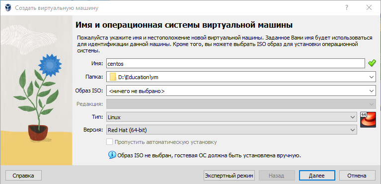{#fig:011 width=70% height=70%}

---

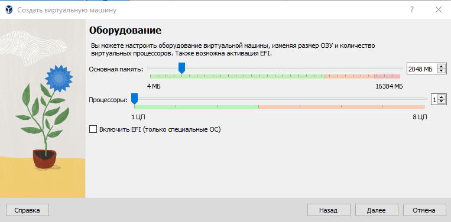{#fig:012 width=70% height=70%}

---

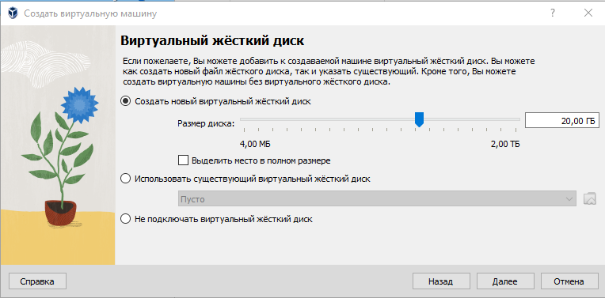{#fig:013 width=70% height=70%}

---

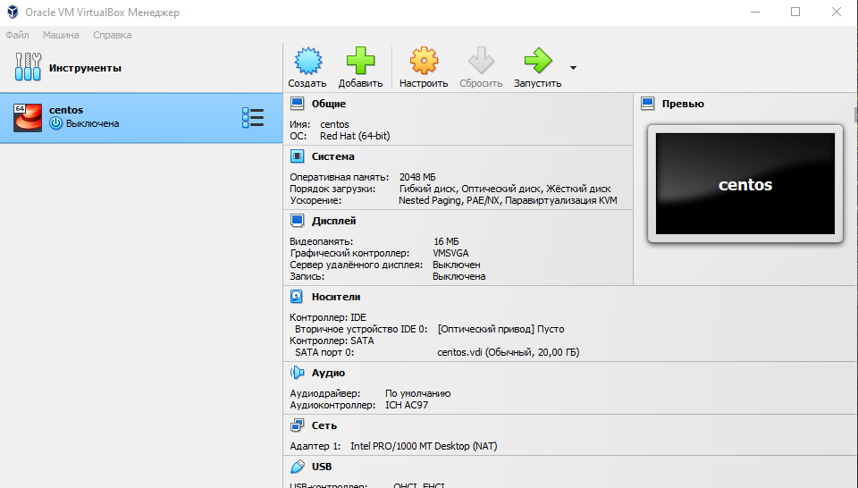{#fig:014 width=70% height=70%}

## Пункт 2: Скачивание и настройка носителя, установка CentOS

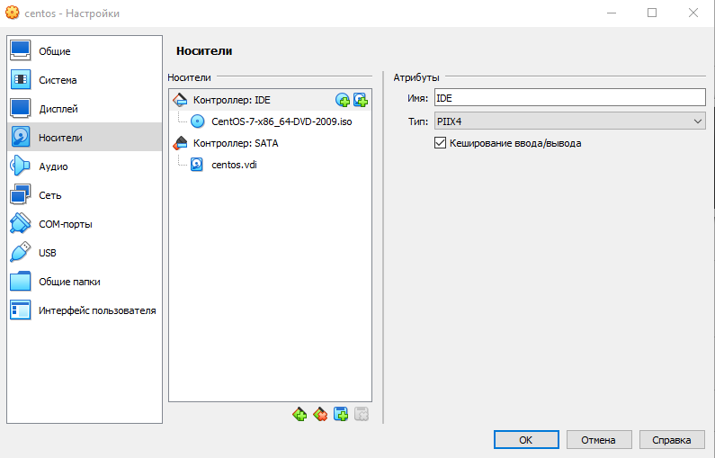{#fig:021 width=70% height=70%}

---

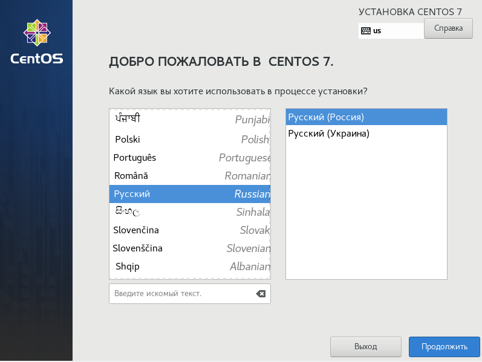{#fig:022 width=70% height=70%}

---

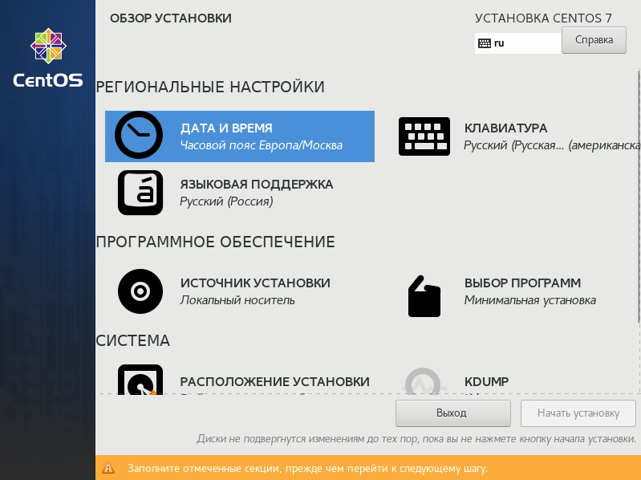{#fig:023 width=70% height=70%}

---

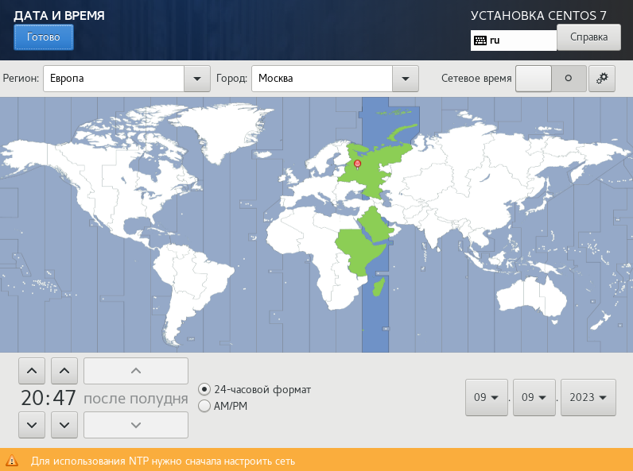{#fig:024 width=70% height=70%}

---

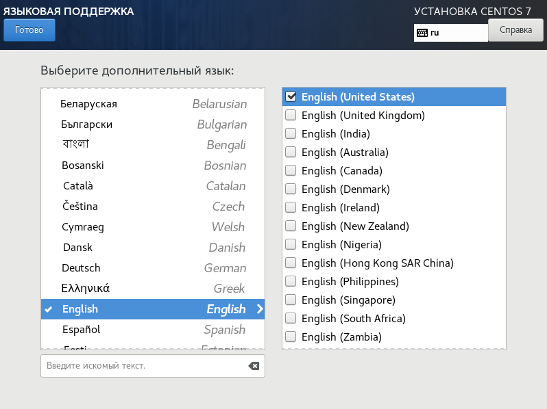{#fig:010 width=70% height=70%}

---

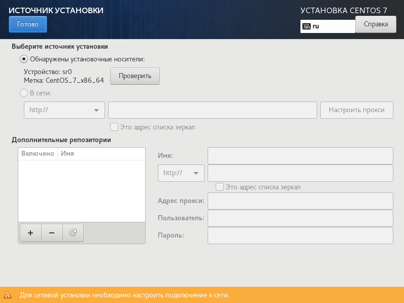{#fig:011 width=70% height=70%}

---

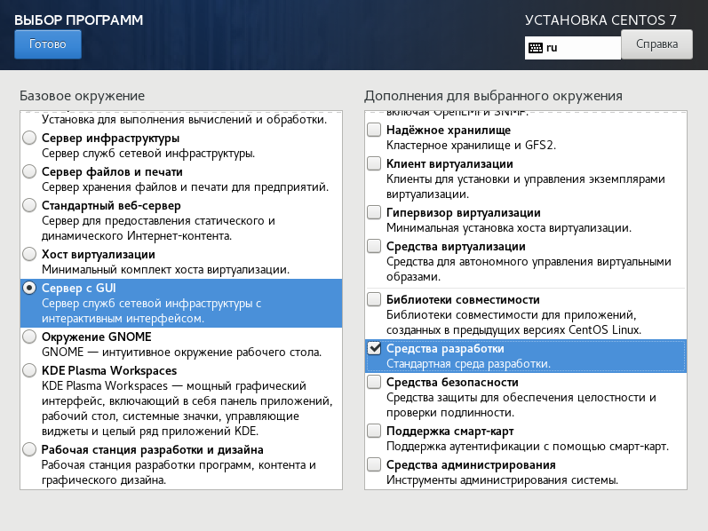{#fig:012 width=70% height=70%}

---

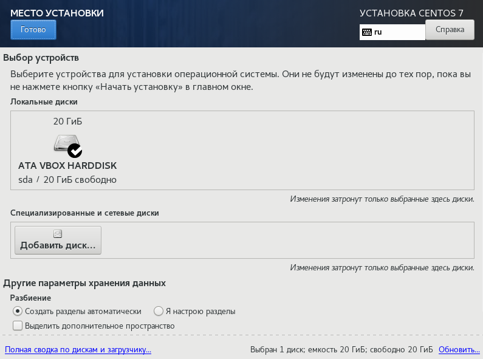{#fig:013 width=70% height=70%}

---

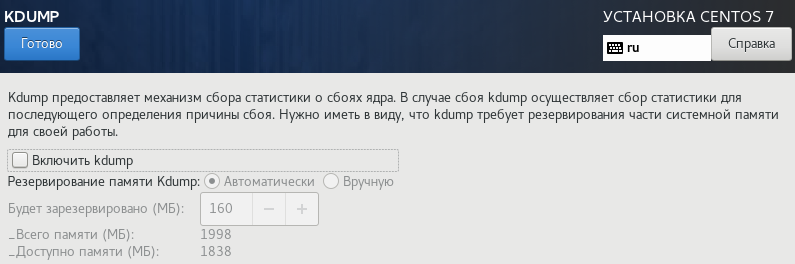{#fig:014 width=70% height=70%}

---

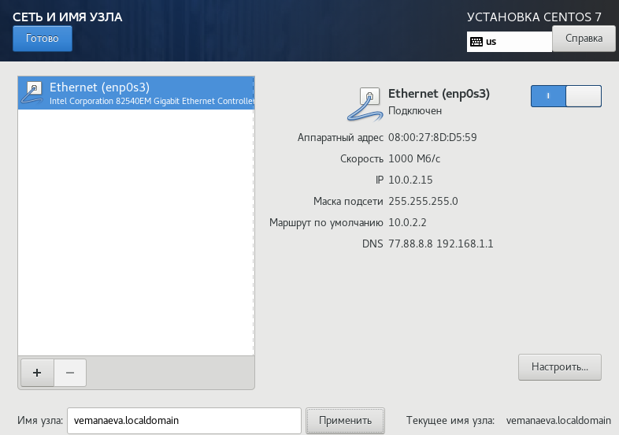{#fig:015 width=70% height=70%}

---

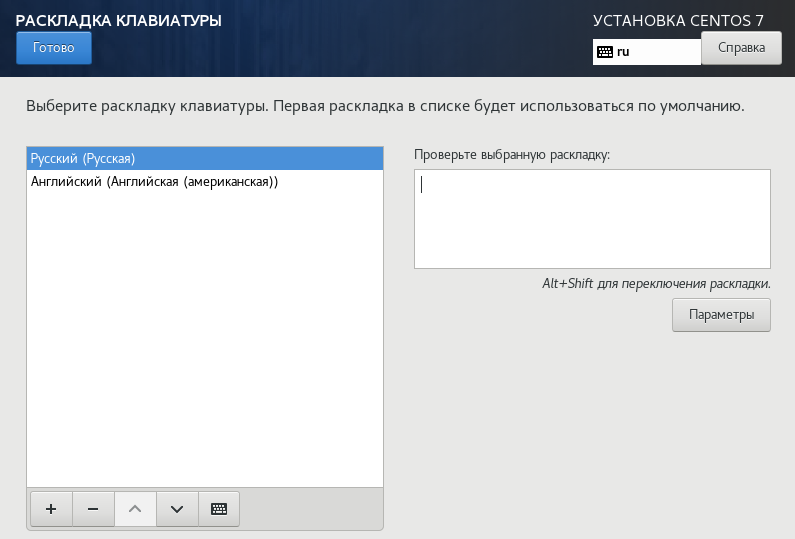{#fig:015 width=70% height=70%}

## Пункт 3: Настройка пользователя и root

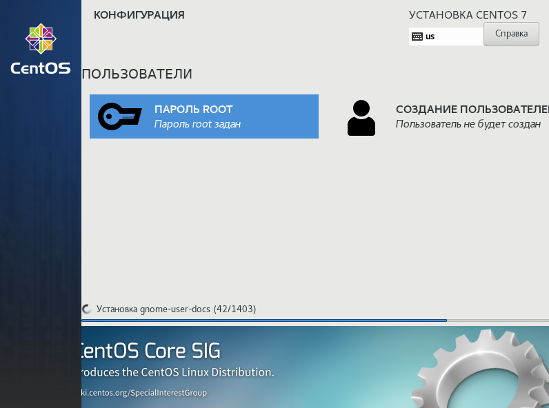{#fig:016 width=70% height=70%}

---

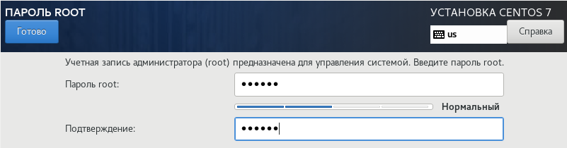{#fig:017 width=70% height=70%}

---

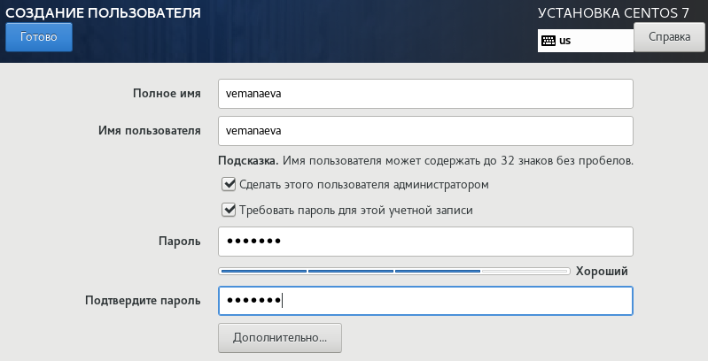{#fig:018 width=70% height=70%}

---

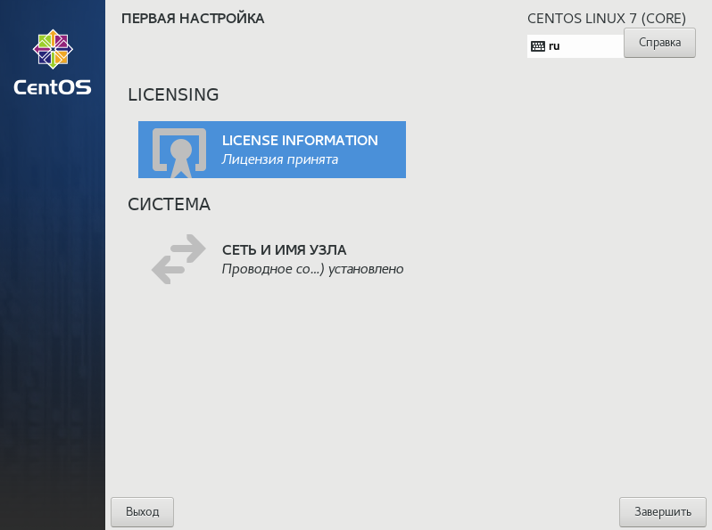{#fig:020 width=70% height=70%}

---

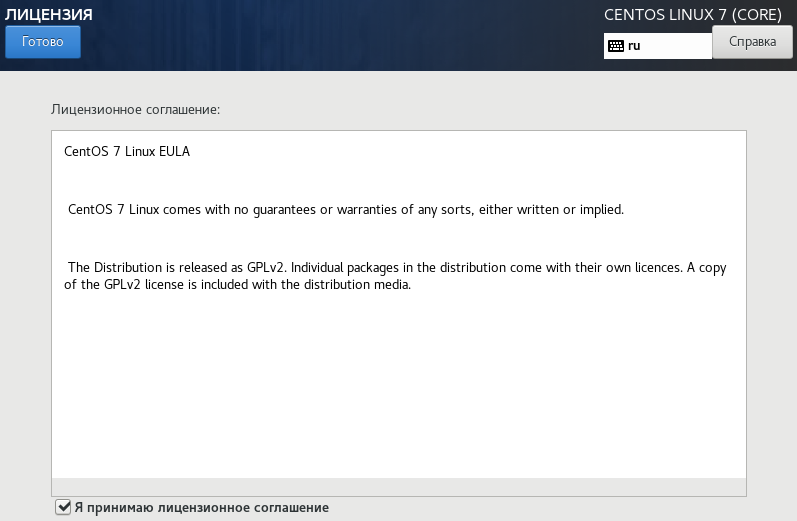{#fig:021 width=70% height=70%}

---

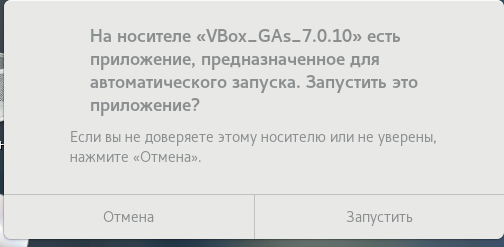{#fig:022 width=70% height=70%}

## Пункт 4. Домашнее задание

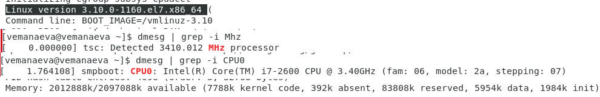{#fig:023 width=70% height=70%}

# Контрольные вопросы

## 1. Какую информацию содержит учётная запись пользователя?

Все важные данные о пользователе в системе хранятся в файлах "/etc/passwd".
В учётной записи хранится в первую очередь ID пользователя (где 0 - это пользователь, обладающий root-правами, а 1-999 - обычные пользователи), 
логин, пароль, идентификатор группы, идентификатор пользователя, начальный каталог и регистрационная оболочка.
Если детально расмотреть структуру хранящихся данных то у нас получится такая строка 
данных: "User ID":"Password":"UID":"GID":"User Info":"Home Dir":"Shell".

## 2. Укажите команды терминала и приведите примеры:

- для получения справки по команде:
команда "man".
Данная команда может предоставить инструкцию или справку по использованию команды или программы.
Если нужна краткая информация, можно применить команду "whatis".

- для перемещения по файловой системе: команда "cd" меняет текущий каталог на указанный,
при пустом вводе перемещает на уровень выше в древе каталога.

- для просмотра содержимого каталога: команда "ls" позволяет просмотреть содержание нынешней папки. Есть так же комадна "ll", 
позволяющая просмотреть начинку директории.
- для определения объёма каталога: команда "sudo du" выведет занимаемое каталогом место на диске.
- для создания / удаления каталогов / файлов: для создания каталога или директории (файлов) "mkdir", а также команды для взаимодействия с ними: 
  - "cp" - копирование и дублирование, 
  - "mv" - перемещение и переиминовывание, 
  - "rm" - удаление папок и файлов. 
  - "cat" - показывает что содержит файл или стандартный ввод, 
  - "ln" - создающая фактически ссылку как в windows ярлыки.

– для задания определённых прав на файл / каталог: команда "chmod".

– для просмотра истории команд: команда "history". Например, указав число после команды, она выведет такое количество последних команд.

## 3. Что такое файловая система? Приведите примеры с краткой характеристикой.

Одно из определений гласит "Файловая система связывает носитель информации (хранилище) с прикладным программным обеспечением, 
организуя доступ к конкретным файлам при помощи функционала взаимодействия программ API".
То есть, файловая система - это набор драйверов, встроенных в систему, которая при обращении программы к файлу по его имени 
(адресу) предоставляет информацию, касающуюся типа носителя, на котором записан файл, и структуры хранения данных. 

Так на системах типа Linux можно увидеть много разных ФС: Ext2, Ext3, Ext4, JFS, ReiserFS, XFS, Btrfs, ZFS и т.д.
А например на Windows в основном используется NTFS для внутрених файлов и FAT32 (или NTFS) для флешек и внешних носителей.
Есть и другие, но они не так важны и универсальны. И на Android, особенно более современных версиях, стоит Ext4 - внутренняя, и FAT32 - внешняя.

NTFS (файловая система новой технологии) стандарт был реализован в Windows NT в 1995 году, и по сей день является основным в Windows. 
Система NTFS имеет допустимый предел размера файлов до 16 гигабайт и размер диска (памяти) до 16 Эксабайт, 
а также использует метод «прозрачного шифрования» (Encryption File System), разделяя доступ к файлам для разных пользователей и приложений.

## 4. Как посмотреть, какие файловые системы подмонтированы в ОС?

На большинстве современных систем можно легко и быстро определить это в свойствах диска.
Но на разных системах Linux есть свои способы это проверить через настройки системы или команды.
Так, например эту информацию можно получить через утилиту Gnome Диски.

## 5. Как удалить зависший процесс?

В windows быстрее всего это сделать через диспечер задач или консоль (Win+R; cmd; tasklist; Taskkill "процесс").
В сестемах Linux есть несколько команд для этого с разной степень серьёзности: 

- "SIGINT" - оправляет приложение команду правильного безопасного завершения, 
- "SIGQUIT" - отличается от предыдущей возможностью проигнорировать сигнал и созданием dump-памяти, 
- "SIGHUP" - сообщает процессу о разрыве соединения с терминалом (в основном связана с неполадками интернета), 
- "SIGTERM" - немедленное завершение процесса проводимого самим процессом или дочерними, 
- "SIGKILL" - зевершение процесса через ядро не мгновенное; 

и команды для убийства: 

- "kill" - и тут многое зависит от опции. Если её нет то используется одна из выше указанных:
  - "-TERM" то пытается принудительно или настойчиво закрыть процесс, и если это не помагает то испольуем 
  - "-KILL" что направляет все силы на уничтожение процесса.

# Выводы по проделанной работе

## Вывод

В результате выполнения работы мы ознакомились с основными этапами установки виртуальных машин и их настроек, 
а также создали виртуальную среду для выполнения последующих лабораторных работ.

Были записаны скринкасты выполнения и защиты лабораторной работы.