---
## Front matter
title: "Лабораторная работа №1"
subtitle: "Дисциплина: Информационная безопасность"
author: "Манаева Варвара Евгеньевна"

## Generic otions
lang: ru-RU
toc-title: "Содержание"

## Bibliography
bibliography: bib/cite.bib
csl: pandoc/csl/gost-r-7-0-5-2008-numeric.csl

## Pdf output format
toc: true # Table of contents
toc-depth: 2
lof: true # List of figures
lot: true # List of tables
fontsize: 12pt
linestretch: 1.5
papersize: a4
documentclass: scrreprt
## I18n polyglossia
polyglossia-lang:
  name: russian
  options:
	- spelling=modern
	- babelshorthands=true
polyglossia-otherlangs:
  name: english
## I18n babel
babel-lang: russian
babel-otherlangs: english
## Fonts
mainfont: PT Serif
romanfont: PT Serif
sansfont: PT Sans
monofont: PT Mono
mainfontoptions: Ligatures=TeX
romanfontoptions: Ligatures=TeX
sansfontoptions: Ligatures=TeX,Scale=MatchLowercase
monofontoptions: Scale=MatchLowercase,Scale=0.9
## Biblatex
biblatex: true
biblio-style: "gost-numeric"
biblatexoptions:
  - parentracker=true
  - backend=biber
  - hyperref=auto
  - language=auto
  - autolang=other*
  - citestyle=gost-numeric
## Pandoc-crossref LaTeX customization
figureTitle: "Рис."
tableTitle: "Таблица"
listingTitle: "Листинг"
lofTitle: "Список иллюстраций"
lotTitle: "Список таблиц"
lolTitle: "Листинги"
## Misc options
indent: true
header-includes:
  - \usepackage{indentfirst}
  - \usepackage{float} # keep figures where there are in the text
  - \floatplacement{figure}{H} # keep figures where there are in the text
---

# Техническое оснащение:

- Персональный компьютер с операционной системой Windows 10;
- Планшет для записи видеосопровождения и голосовых комментариев;
- Microsoft Teams, использующийся для записи скринкаста лабораторной работы;
- Приложение Pycharm для редактирования файлов формата *md*;
- *pandoc* для конвертации файлов отчётов и презентаций.

# Цели и задачи работы
## Цель

Приобретение практических навыков установки операционной системы на виртуальную машину и 
настройки минимально необхдимых для дальнейшей работы сервисов.

## Задачи

1. Создать виртуальную машину через VirtualBox и настроить её;
2. Скачать и установить образ CentOS;
3. Запустить обаз диска дополнений гостевой ОС и настроить систему;
4. Выполнить домашнее задание.

# Теоретическое введение
## Соглашение об именовании

При выполнении работ следует придерживаться следующих правил именования: имя виртуальной машины, имя хоста вашей виртуальной машины,
пользователь внутри виртуальной машины должны совпадать с логином
студента, выполняющего лабораторную работу. Вы можете посмотреть
ваш логин, набрав в терминале ОС типа Linux команду id -un.

# Выполнение лабораторной работы
## Создание виртуальной машины

Воспользовавшись функцией "создать" в VirtualBox, начала создавать виртуальную машину для дальнейшего выполнения лабораторных работ (рис. @fig:011).

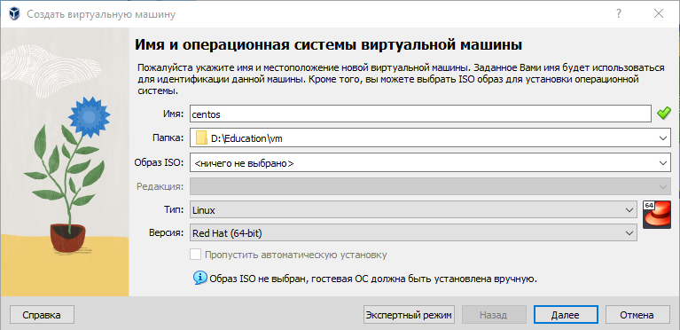{#fig:011 width=70% height=70%}

Настроила оперативную память и количество процессоров, выделенное для виртуальной машины (рис. @fig:012).

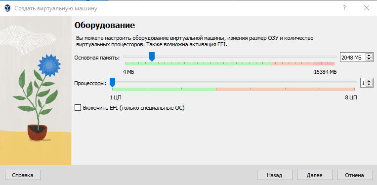{#fig:012 width=70% height=70%}

Настроила виртуальный жёсткий диск и выделила на нёс 20 ГБ памяти (рис. @fig:013).

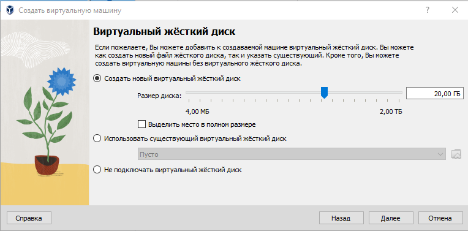{#fig:013 width=70% height=70%}

После завершения создания виртуальной машины проверила правильность её создания (рис. @fig:014).

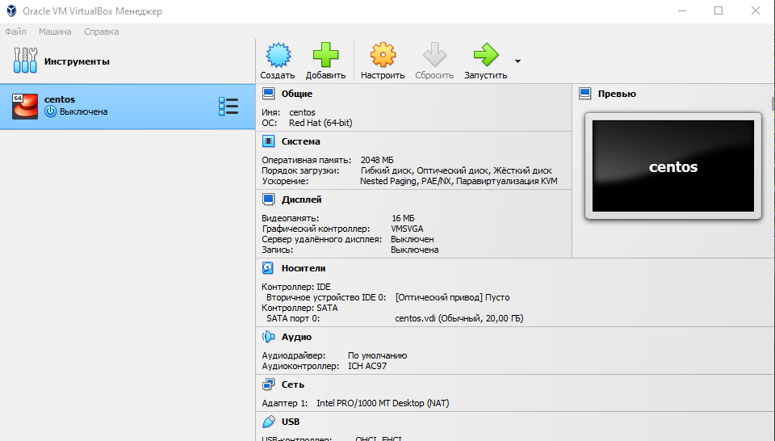{#fig:014 width=70% height=70%}

## Скачивание и настройка носителя, установка CentOS

В настройках виртуальной машины внутри виртуальной коробки установила в носители образ диска с операционной системой (рис. @fig:021).

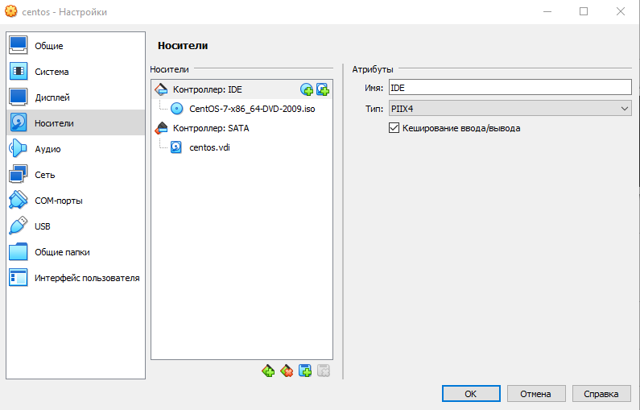{#fig:021 width=70% height=70%}

После запуска и первичной загрузки появилось меню выбора языка установки с надписью "Добро пожаловать" (рис. @fig:022).

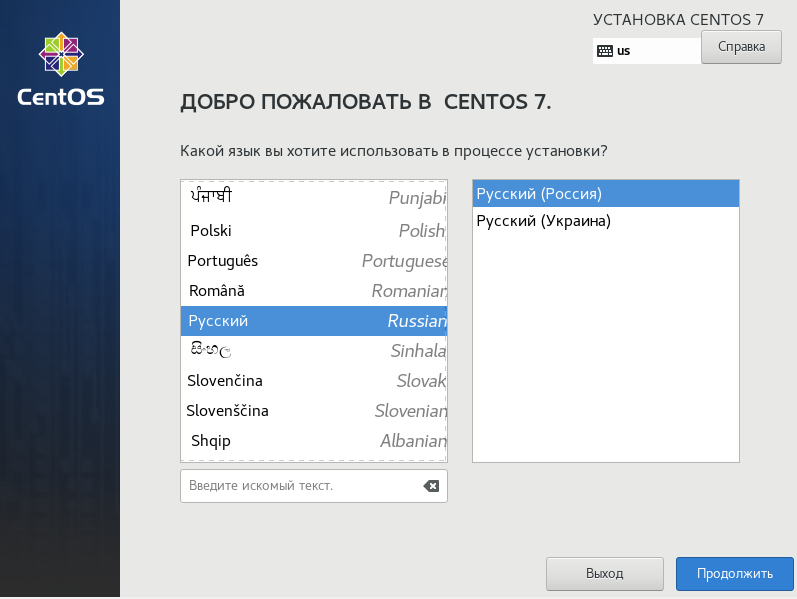{#fig:022 width=70% height=70%}

После выбора языка попала в меню настройки образа установки (рис. @fig:023).

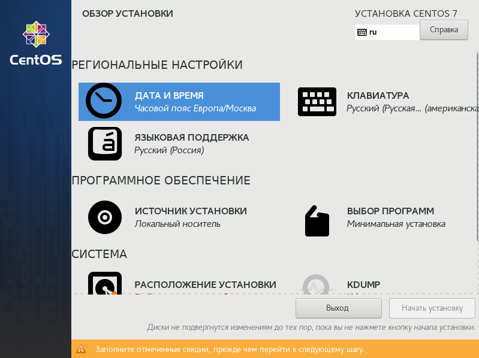{#fig:023 width=70% height=70%}

Проверила часовой пояс, дату и время системы (рис. @fig:024).

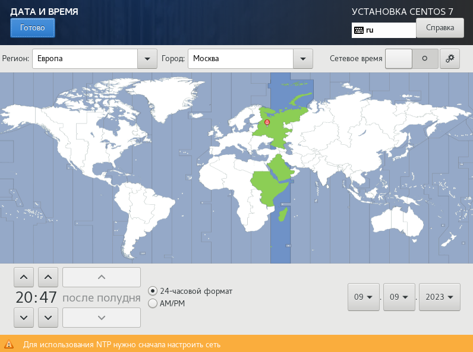{#fig:024 width=70% height=70%}

Подключила поддержку американского английского помимо русского российского языка (рис. @fig:025).

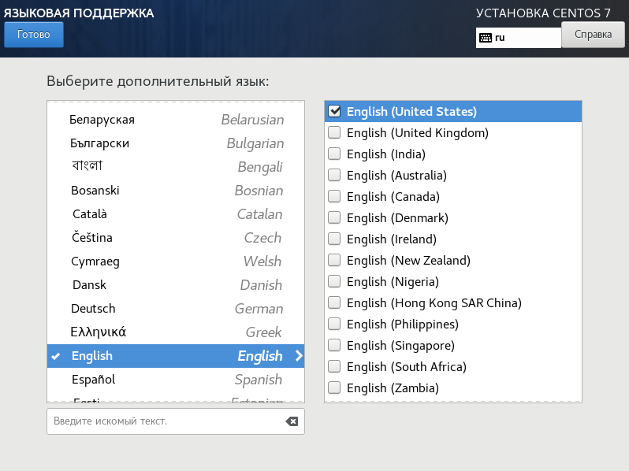{#fig:025 width=70% height=70%}

Проверила источник установки ОС CentOS (рис. @fig:026).

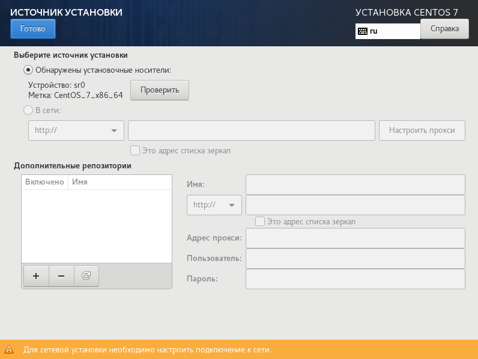{#fig:026 width=70% height=70%}

Выбрала сервер с GUI в качестве базового окружения и установила средства разработки для дальнейшей работы в будущем (рис. @fig:027).

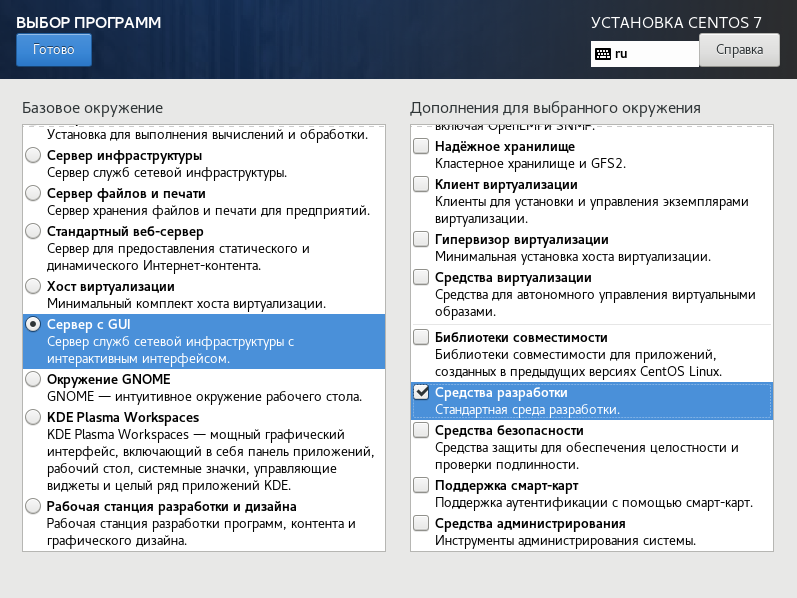{#fig:027 width=70% height=70%}

Проверила подключение виртуального диска (рис. @fig:028).

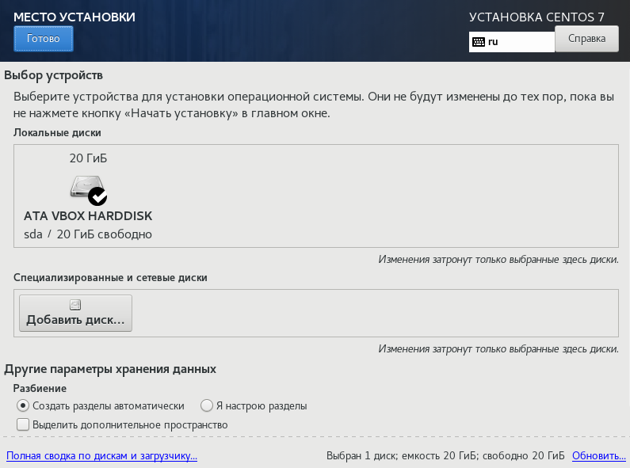{#fig:028 width=70% height=70%}

Отключила за ненадобностью KDUMP (рис. @fig:029).

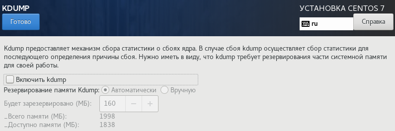{#fig:029 width=70% height=70%}

Настроила сетевой доступ (рис. @fig:120).

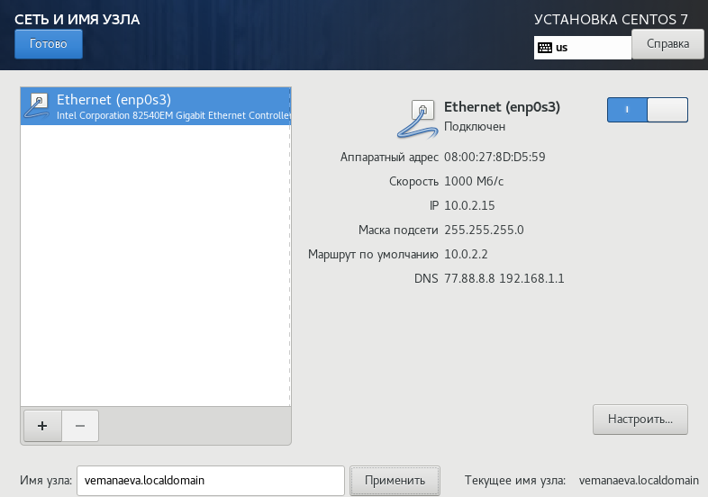{#fig:120 width=70% height=70%}

Добавила английскую раскладку клавиатуры и проверила обе раскладки на правильность с помощью спецального окна (рис. @fig:121).

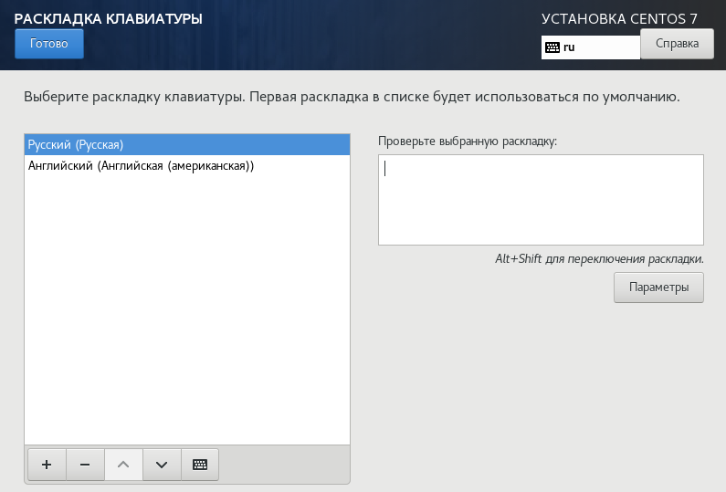{#fig:121 width=70% height=70%}

## Настройка пользователя и root

После завершения работы с образом установки, начался процесс установки и конфигурации ОС (рис. @fig:031). 
В процессе нужно было установить root-пароль (рис. @fig:032) и создать пользователя с именем согласно соглашению о именовании (рис. @fig:033).

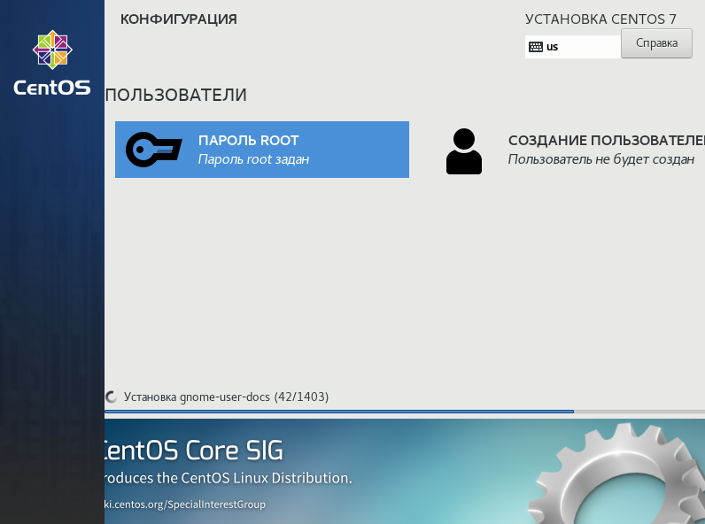{#fig:031 width=70% height=70%}

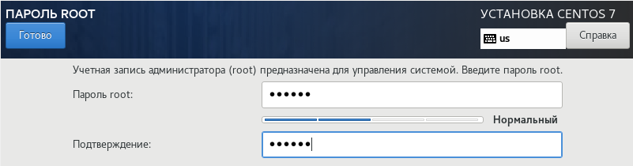{#fig:032 width=70% height=70%}

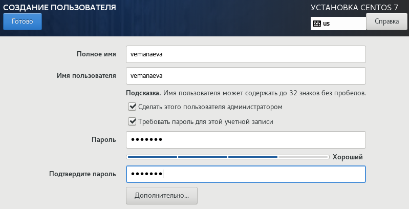{#fig:033 width=70% height=70%}

На этом моменте машине необходимо было перезагрузиться, после чего необходимо было через окно первой настройки (рис. @fig:034) перейти в 
окно подтверждения согласия с лицензией (рис. @fig:035) и затем, после возвращения в окно первой настройки, завершить её.

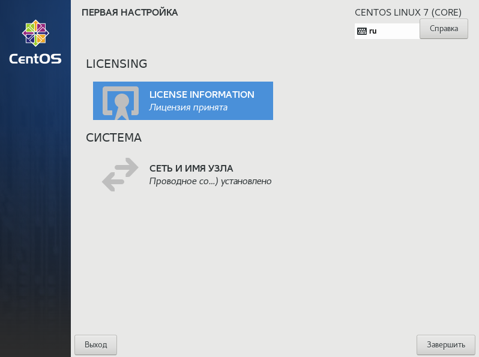{#fig:034 width=70% height=70%}

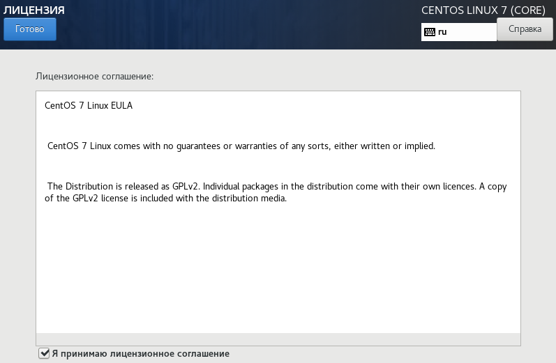{#fig:035 width=70% height=70%}

После первой загрузки операционной системы, необходимо было установить дополнения гостевой ОС через функции виртуальной коробки.
Данная функция создала и запустила в гостевой образ диска (рис. @fig:036), который и установил необходимые дополнения. 

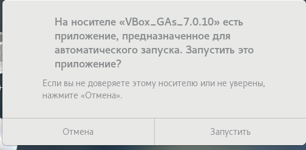{#fig:036 width=70% height=70%}

## Домашнее задание

После установки дополнений можно было перейти к выполенению домашнего задания. С помощью команды dmesg получили следующую информацию (рис. @fig:041):

1. Версия ядра Linux (Linux version);
2. Частота процессора (Detected Mhz processor);
3. Модель процессора (CPU0);
4. Объем доступной оперативной памяти (Memory available).

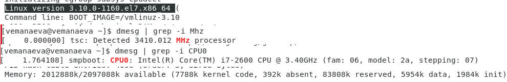{#fig:041 width=70% height=70%}

# Контрольные вопросы

## Какую информацию содержит учётная запись пользователя?

Все важные данные о пользователе в системе хранятся в файлах "/etc/passwd".
В учётной записи хранится в первую очередь ID пользователя (где 0 - это пользователь, обладающий root-правами, а 1-999 - обычные пользователи), 
логин, пороль, идентификатор группы, идентификатор пользователя, начальный каталог и регистрационная оболочка.
Если детально расмотреть структуру хранящихся данных то у нас получится такая строка 
данных: "User ID":"Password":"UID":"GID":"User Info":"Home Dir":"Shell".

## Укажите команды терминала и приведите примеры:

- для получения справки по команде:
команда "man".
Данная команда может предоставить инструкцию или справку по использованию команды или программы.
Если нужна краткая информация, можно применить команду "whatis".

- для перемещения по файловой системе: команда "cd" меняет текущий каталог на указанный,
при пустом вводе перемещает на уровень выше в древе каталога.

- для просмотра содержимого каталога: команда "ls" позволяет просмотреть содержание нынешней папки. Есть так же комадна "ll", 
позволяющая просмотреть начинку директории.
- для определения объёма каталога: команда "sudo du" выведет занимаемое каталогом место на диске.
- для создания / удаления каталогов / файлов: для создания каталога или директории (файлов) "mkdir", а также команды для взаимодействия с ними: 
  1. "cp" - основная задача копирование и дублирование, 
  2. "mv" - перемещение и переиминовывание, 
  3. "rm" - удаление папок и файлов. 
  4. "cat" - показывает что содержит файл или стандартный ввод, 
  5. "ln" - создающая фактически ссылку как в windows ярлыки.

- для задания определённых прав на файл / каталог: команда "chmod".
- для просмотра истории команд: команда "history". Например, указав число после команды, она выведет такое количество последних команд.

## Что такое файловая система? Приведите примеры с краткой характеристикой.

Одно из определений гласит "Файловая система связывает носитель информации (хранилище) с прикладным программным обеспечением, 
организуя доступ к конкретным файлам при помощи функционала взаимодействия программ API".
То есть, файловая система - это набор драйверов, встроенных в систему, которая при обращении программы к файлу по его имени 
(адресу) предоставляет информацию, касающуюся типа носителя, на котором записан файл, и структуры хранения данных. 

Так на системах типа Linux можно увидеть много разных ФС: Ext2, Ext3, Ext4, JFS, ReiserFS, XFS, Btrfs, ZFS и т.д.
А например на Windows в основном используется NTFS для внутрених файлов и FAT32 (или NTFS) для флешек и внешних носителей.
Есть и другие, но они не так важны и универсальны. И на Android, особенно более современных версиях, стоит Ext4 - внутренняя, и FAT32 - внешняя.

NTFS (файловая система новой технологии) стандарт был реализован в Windows NT в 1995 году, и по сей день является основным в Windows. 
Система NTFS имеет допустимый предел размера файлов до 16 гигабайт и размер диска (памяти) до 16 Эксабайт, 
а также использует метод «прозрачного шифрования» (Encryption File System), разделяя доступ к файлам для разных пользователей и приложений.

## Как посмотреть, какие файловые системы подмонтированы в ОС?

На большинстве современных систем можно легко и быстро определить это в свойствах диска.
Но на разных системах Linux есть свои способы это проверить через настройки системы или команды.
Так, например эту информацию можно получить через утилиту Gnome Диски.

## Как удалить зависший процесс?

В windows быстрее всего это сделать через диспечер задач или консоль (Win+R; cmd; tasklist; Taskkill "процесс").
В сестемах Linux есть несколько команд для этого с разной степень серьёзности: 

- "SIGINT" - оправляет приложение команду правильного безопасного завершения, 
- "SIGQUIT" - отличается от предыдущей возможностью проигнорировать сигнал и созданием dump-памяти, 
- "SIGHUP" - сообщает процессу о разрыве соединения с терминалом (в основном связана с неполадками интернета), 
- "SIGTERM" - немедленное завершение процесса проводимого самим процессом или дочерними, 
- "SIGKILL" - зевершение процесса через ядро не мгновенное; 

и команды для убийства: 

- "kill" - и тут многое зависит от опции. Если её нет то используется одна из выше указанных:
- "-TERM" то пытается принудительно или настойчиво закрыть процесс, и если это не помагает то испольуем 
- "-KILL" что направляет все силы на уничтожение процесса.

# Выводы по проделанной работе

## Вывод

В результате выполнения работы мы ознакомились с основными этапами установки виртуальных машин и их настроек, 
а также создали виртуальную среду для выполнения последующих лабораторных работ.

Были записаны скринкасты выполнения и защиты лабораторной работы.

Ссылки на скринкасты:

- [Выполнение, Youtube](https://youtu.be/p9smbkIezso)
- [Выполнение, Rutube](https://rutube.ru/video/1fdf6ef5d16783dda142099576af7bdc/)
- [Защита презентации, Youtube](https://youtu.be/CXELivKCEdQ)
- [Защита презентации, Rutube](https://rutube.ru/video/2ade4abf5bf61bcbefb9a8f3b2384f5a/)

