---
## Front matter
lang: ru-RU
title: "Лабораторная работа №2"
subtitle: "Дисциплина: Информационная безопасность"
author:
  - Манаева Варвара Евгеньевна.
institute:
  - Российский университет дружбы народов, Москва, Россия
date: 16 сентября 2023

## i18n babel
babel-lang: russian
babel-otherlangs: english

## Formatting pdf
toc: false
toc-title: Содержание
slide_level: 2
aspectratio: 169
section-titles: true
theme: metropolis
header-includes:
 - \metroset{progressbar=frametitle,sectionpage=progressbar,numbering=fraction}
 - '\makeatletter'
 - '\beamer@ignorenonframefalse'
 - '\makeatother'
---

# Цели и задачи работы

## Цель лабораторной работы

Получение практических навыков работы в консоли с атрибутами файлов, 
закрепление теоретических основ дискреционного разграничения доступа в современных системах с открытым кодом на базе ОС Linux.

## Задачи

1. Создать нового пользователя (гостевой аккаунт) виртуальной машины;
2. Через гостевой аккаунт выполнить задания лабораторной работы;
3. Заполнить таблицы об уровнях доступа и действиях с файлами/директориями.

# Выполение лабораторной работы

## В установленной ОС создаю учетную запись пользователя guest.

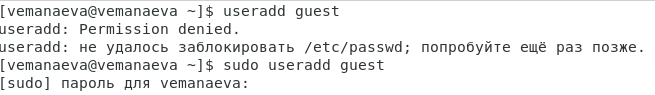{#fig:001 width=70% height=70%}

## Задаю пароль для созданного пользователя.

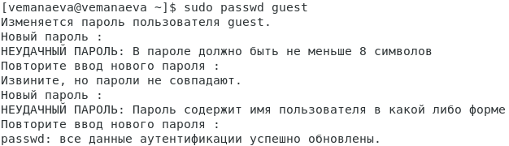{#fig:002 width=70% height=70%}

## Вхожу в систему от имени созданного пользователя.

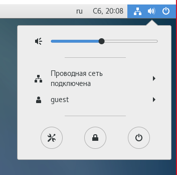{#fig:003 width=70% height=70%}

## С помощью команды pwd определяю директорию.

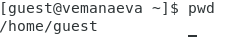{#fig:004 width=70% height=70%}

## Уточняю имя пользователя командой whoami.

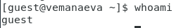{#fig:005 width=70% height=70%}

## Уточняю имя пользователя, группу, и группы, куда входит пользователь.

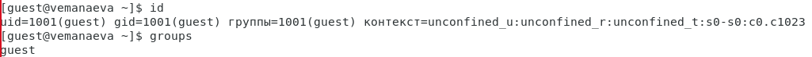{#fig:006 width=70% height=70%}

## Сравниваю полученные данные с данными в приглашении командной строки.

{#fig:007 width=70% height=70%}

## Просматриваю файл /etc/passwd командой cat /etc/passwd.

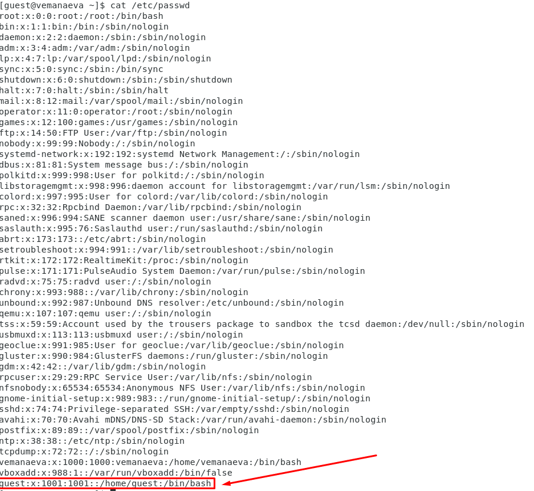{#fig:108 width=70%}

## Определяю существующие в системе директории командой ls -l /home/

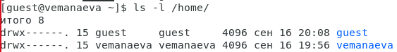{#fig:009 width=70% height=70%}

## Проверяю, какие расширенные атрибуты установлены на поддиректориях, находящихся в директории /home, командой

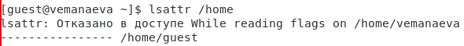{#fig:010 width=70% height=70%}

## Создаю в домашней директории поддиректорию dir1 командой mkdir dir1

Определяю командами ls -l и lsattr, какие права доступа и расширенные атрибуты были выставлены на директорию dir1.

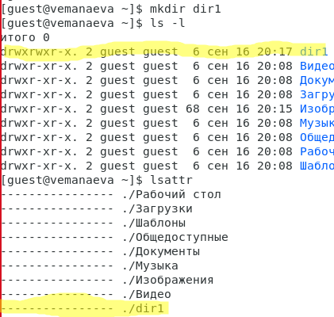{#fig:011 width=70% height=70%}

## Снимаю с директории dir1 все атрибуты командой chmod 000 dir1 и проверяю с её помощью правильность выполнения команды ls -l

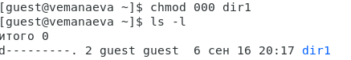{#fig:012 width=70% height=70%}

## Совершаю попытку создания в директории dir1 файл file1 командой echo "test" > /home/guest/dir1/file1

Проверяю командой ls -l /home/guest/dir1 действительно ли файл file1 не находится внутри директории dir1.

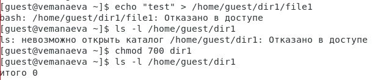{#fig:013 width=70% height=70%}

## Заполняю таблицу «Установленные права и разрешённые действия»

: Отрывок из таблицы "Установленные права и разрешённые действия" {#tbl:access_1}

| Права директории            | Права файла | Создание файла | Удаление файла | Запись файла | Чтение файла | Смена директории | Просмотр файлов в директории | Переименование файла | Смена атрибутов файла |
|-----------------------------|-------------|----------------|----------------|--------------|--------------|------------------|------------------------------|----------------------|-----------------------|
| d-wx------                  | (000)       | +              | +              | -            | -            | +                | -                            | +                    | -                     |
| d-wx------                  | (100)       | +              | +              | -            | -            | +                | -                            | +                    | -                     |
| d-wx------                  | (200)       | +              | +              | +            | -            | +                | -                            | +                    | -                     |
| d-wx------                  | (300)       | +              | +              | +            | -            | +                | -                            | +                    | -                     |
| d-wx------                  | (400)       | +              | +              | -            | +            | +                | -                            | +                    | +                     |
| d-wx------                  | (500)       | +              | +              | -            | +            | +                | -                            | +                    | +                     |
| d-wx------                  | (600)       | +              | +              | +            | +            | +                | -                            | +                    | +                     |
| d-wx------                  | (700)       | +              | +              | +            | +            | +                | -                            | +                    | +                     |

## На основании заполненной таблицы определяю те или иные минимально необходимые права для выполнения операций внутри директории dir1

: Минимальные права для совершения операций {#tbl:access_2}

| Операция               | Минимальные права на директорию | Минимальные права на файл |
|------------------------|---------------------------------|---------------------------|
| Создание файла         | d-wx------                      | (000)                     |
| Удаление файла         | d-wx------                      | (000)                     |
| Чтение файла           | d--x------                      | (400)                     |
| Запись в файл          | d--x------                      | (200)                     |
| Переименование файла   | d-wx------                      | (000)                     |
| Создание поддиректории | d-wx------                      | (000)                     |
| Удаление поддиректории | d-wx------                      | (000)                     |

# Выводы по проделанной работе

## Вывод

В результате выполнения работы мы получили пракические навыки работы в консоли с атрибутами файлов и 
закрепили теоретические основы дискреционного разграничения доступа в современных системах на базе ОС Linux.

Были записаны скринкасты выполнения и защиты лабораторной работы.

