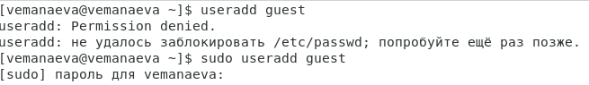
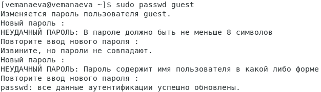
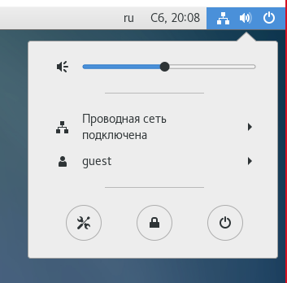
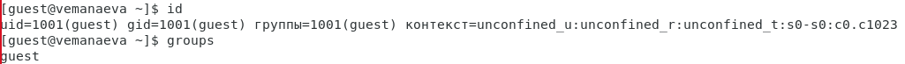
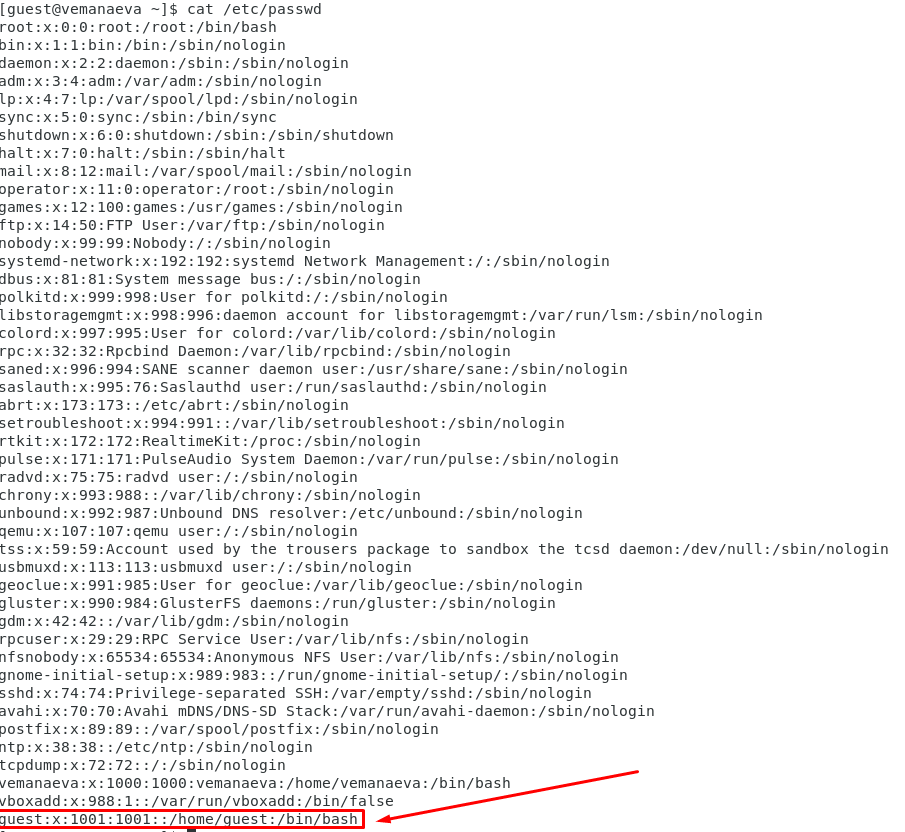
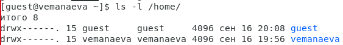
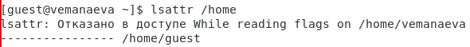
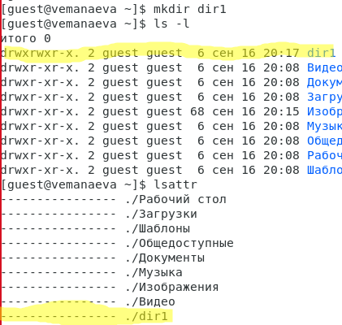
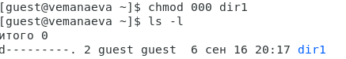
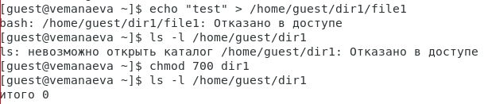

---
## Front matter
title: "Лабораторная работа №2"
subtitle: "Дисциплина: Информационная безопасность"
author: "Манаева Варвара Евгеньевна"

## Generic otions
lang: ru-RU
toc-title: "Содержание"

## Bibliography
bibliography: bib/cite.bib
csl: pandoc/csl/gost-r-7-0-5-2008-numeric.csl

## Pdf output format
toc: true # Table of contents
toc-depth: 2
lof: true # List of figures
lot: true # List of tables
fontsize: 12pt
linestretch: 1.5
papersize: a4
documentclass: scrreprt
## I18n polyglossia
polyglossia-lang:
  name: russian
  options:
	- spelling=modern
	- babelshorthands=true
polyglossia-otherlangs:
  name: english
## I18n babel
babel-lang: russian
babel-otherlangs: english
## Fonts
mainfont: PT Serif
romanfont: PT Serif
sansfont: PT Sans
monofont: PT Mono
mainfontoptions: Ligatures=TeX
romanfontoptions: Ligatures=TeX
sansfontoptions: Ligatures=TeX,Scale=MatchLowercase
monofontoptions: Scale=MatchLowercase,Scale=0.9
## Biblatex
biblatex: true
biblio-style: "gost-numeric"
biblatexoptions:
  - parentracker=true
  - backend=biber
  - hyperref=auto
  - language=auto
  - autolang=other*
  - citestyle=gost-numeric
## Pandoc-crossref LaTeX customization
figureTitle: "Рис."
tableTitle: "Таблица"
listingTitle: "Листинг"
lofTitle: "Список иллюстраций"
lotTitle: "Список таблиц"
lolTitle: "Листинги"
## Misc options
indent: true
header-includes:
  - \usepackage{indentfirst}
  - \usepackage{float} # keep figures where there are in the text
  - \floatplacement{figure}{H} # keep figures where there are in the text
---

# Техническое оснащение:

- Персональный компьютер с операционной системой Windows 10;
- Планшет для записи видеосопровождения и голосовых комментариев;
- Microsoft Teams, использующийся для записи скринкаста лабораторной работы;
- Приложение Pycharm для редактирования файлов формата *md*;
- *pandoc* для конвертации файлов отчётов и презентаций.

# Цели и задачи работы
## Цель

Получение практических навыков работы в консоли с атрибутами файлов,
закрепление теоретических основ дискреционного разграничения доступа в
современных системах с открытым кодом на базе ОС Linux.

## Задачи

1. Создать нового пользователя (гостевой аккаунт) виртуальной машины;
2. Через гостевой аккаунт выполнить задания лабораторной работы;
3. Заполнить таблицы об уровнях доступа и действиях с файлами/директориями.

# Теоретическое введение [@b:linux]

Для разграничения действий над файлами определены три базовых права доступа (базовые разрешения):

- чтение r — «read»,
- запись w — «write» и
- выполнение х — «execute»,

соответствующие разрешению выполнять системные вызовы read, write и execve (точнее, системному вызову open с флагами O_RDONLY и O_WRONLY, но для простоты можно считать r — read, a w — write).

Каждое из базовых прав назначается на файл тому или иному пользователю или группе, разрешая соответствующую операцию.

В наследии классической UNIX определены только три субъекта, которым назначаются базовые права — пользователь-владелец (owner), группа-владелец (group owner) и все остальные (others). Совокупность их базовых прав называется режимом доступа (access mode) к файлу.

Базовое право может быть назначено r, w или х или отозвано —, поэтому в метаданных файла представляется одним битом, а для режима доступа требуется девять бит: по три бита прав на каждый из трех субъектов доступа.

Компактно режим доступа может быть записан соответствующим числом в восьмеричной системе счисления rw-r--r-- $\to$ $110100100_2$ $\to$ $644_8$.

# Выполнение лабораторной работы

1. В установленной ОС создаю учетную запись пользователя guest.

{#fig:001 width=70% height=70%}

2. Задаю пароль для созданного пользователя.

{#fig:002 width=70% height=70%}

3. Вхожу в систему от имени созданного пользователя.

{#fig:003 width=70% height=70%}

4. С помощью команды pwd определяю директорию.

{#fig:004 width=70% height=70%}

5. Уточняю имя пользователя командой whoami.

{#fig:005 width=70% height=70%}

6. Уточняю имя пользователя, группу, и группы, куда входит пользователь.

{#fig:006 width=70% height=70%}

7. Сравниваю полученные данные с данными в приглашении командной строке.

{#fig:007 width=70% height=70%}

8. Просматриваю файл /etc/passwd командой cat /etc/passwd.

{#fig:108 width=70%}

9. Определяю существующие в системе директории командой ls -l /home/

{#fig:009 width=70% height=70%}

10. Проверяю, какие расширенные атрибуты установлены на поддиректориях, находящихся в директории /home, командой

{#fig:010 width=70% height=70%}

11. Создаю в домашней директории поддиректорию dir1 командой mkdir dir1

Определяю командами ls -l и lsattr, какие права доступа и расширенные атрибуты были выставлены на директорию dir1.

{#fig:011 width=70% height=70%}

12. Снимаю с директории dir1 все атрибуты командой chmod 000 dir1 и проверяю с её помощью правильность выполнения команды ls -l

{#fig:012 width=70% height=70%}

13. Совершаю попытку создания в директории dir1 файл file1 командой echo "test" > /home/guest/dir1/file1

Проверяю командой ls -l /home/guest/dir1 действительно ли файл file1 не находится внутри директории dir1.

{#fig:013 width=70% height=70%}

Далее заполняю таблицы

## Таблицы (@tbl:access_1 и @tbl:access_2)

: Установленные права и разрешённые действия {#tbl:access_1}

| Права директории            | Права файла   | Создание файла   | Удаление файла   | Запись файла   | Чтение файла   | Смена директории   | Просмотр файлов в директории   | Переименование файла   | Смена атрибутов файла   |
|-----------------------------|---------------|------------------|------------------|----------------|----------------|--------------------|--------------------------------|------------------------|-------------------------|
| d(000)                      | (000)         | -                | -                | -              | -              | -                  | -                              | -                      | -                       |
| d(000)                      | (100)         | -                | -                | -              | -              | -                  | -                              | -                      | -                       |
| d(000)                      | (200)         | -                | -                | -              | -              | -                  | -                              | -                      | -                       |
| d(000)                      | (300)         | -                | -                | -              | -              | -                  | -                              | -                      | -                       |
| d(000)                      | (400)         | -                | -                | -              | -              | -                  | -                              | -                      | -                       |
| d(000)                      | (500)         | -                | -                | -              | -              | -                  | -                              | -                      | -                       |
| d(000)                      | (600)         | -                | -                | -              | -              | -                  | -                              | -                      | -                       |
| d(000)                      | (700)         | -                | -                | -              | -              | -                  | -                              | -                      | -                       |
|-----------------------------| ------------- | ---------------- | ---------------- | -------------- | -------------- | ------------------ | ------------------------------ | ---------------------- | ----------------------- |
| d--x------                  | (000)         | -                | -                | -              | -              | +                  | -                              | -                      | -                       |
| d--x------                  | (100)         | -                | -                | -              | -              | +                  | -                              | -                      | -                       |
| d--x------                  | (200)         | -                | -                | -              | -              | +                  | -                              | -                      | -                       |
| d--x------                  | (300)         | -                | -                | -              | -              | +                  | -                              | -                      | -                       |
| d--x------                  | (400)         | -                | -                | -              | +              | +                  | -                              | -                      | -                       |
| d--x------                  | (500)         | -                | -                | -              | +              | +                  | -                              | -                      | -                       |
| d--x------                  | (600)         | -                | -                | -              | +              | +                  | -                              | -                      | -                       |
| d--x------                  | (700)         | -                | -                | -              | +              | +                  | -                              | -                      | -                       |
|-----------------------------| ------------- | ---------------- | ---------------- | -------------- | -------------- | ------------------ | ------------------------------ | ---------------------- | ----------------------- |
| d-w-------                  | (000)         | -                | -                | -              | -              | -                  | -                              | -                      | -                       |
| d-w-------                  | (100)         | -                | -                | -              | -              | -                  | -                              | -                      | -                       |
| d-w-------                  | (200)         | -                | -                | -              | -              | -                  | -                              | -                      | -                       |
| d-w-------                  | (300)         | -                | -                | -              | -              | -                  | -                              | -                      | -                       |
| d-w-------                  | (400)         | -                | -                | -              | -              | -                  | -                              | -                      | -                       |
| d-w-------                  | (500)         | -                | -                | -              | -              | -                  | -                              | -                      | -                       |
| d-w-------                  | (600)         | -                | -                | -              | -              | -                  | -                              | -                      | -                       |
| d-w-------                  | (700)         | -                | -                | -              | -              | -                  | -                              | -                      | -                       |
|-----------------------------| ------------- | ---------------- | ---------------- | -------------- | -------------- | ------------------ | ------------------------------ | ---------------------- | ----------------------- |
| d-wx------                  | (000)         | +                | +                | -              | -              | +                  | -                              | +                      | -                       |
| d-wx------                  | (100)         | +                | +                | -              | -              | +                  | -                              | +                      | -                       |
| d-wx------                  | (200)         | +                | +                | +              | -              | +                  | -                              | +                      | -                       |
| d-wx------                  | (300)         | +                | +                | +              | -              | +                  | -                              | +                      | -                       |
| d-wx------                  | (400)         | +                | +                | -              | +              | +                  | -                              | +                      | +                       |
| d-wx------                  | (500)         | +                | +                | -              | +              | +                  | -                              | +                      | +                       |
| d-wx------                  | (600)         | +                | +                | +              | +              | +                  | -                              | +                      | +                       |
| d-wx------                  | (700)         | +                | +                | +              | +              | +                  | -                              | +                      | +                       |
|-----------------------------| ------------- | ---------------- | ---------------- | -------------- | -------------- | ------------------ | ------------------------------ | ---------------------- | ----------------------- |
| dr--------                  | (000)         | -                | -                | -              | -              | -                  | +                              | -                      | -                       |
| dr--------                  | (100)         | -                | -                | -              | -              | -                  | +                              | -                      | -                       |
| dr--------                  | (200)         | -                | -                | -              | -              | -                  | +                              | -                      | -                       |
| dr--------                  | (300)         | -                | -                | -              | -              | -                  | +                              | -                      | -                       |
| dr--------                  | (400)         | -                | -                | -              | -              | -                  | +                              | -                      | -                       |
| dr--------                  | (500)         | -                | -                | -              | -              | -                  | +                              | -                      | -                       |
| dr--------                  | (600)         | -                | -                | -              | -              | -                  | +                              | -                      | -                       |
| dr--------                  | (700)         | -                | -                | -              | -              | -                  | +                              | -                      | -                       |
|-----------------------------| ------------- | ---------------- | ---------------- | -------------- | -------------- | ------------------ | ------------------------------ | ---------------------- | ----------------------- |
| dr-x------                  | (000)         | -                | -                | -              | -              | +                  | +                              | -                      | -                       |
| dr-x------                  | (100)         | -                | -                | -              | -              | +                  | +                              | -                      | -                       |
| dr-x------                  | (200)         | -                | -                | +              | -              | +                  | +                              | -                      | -                       |
| dr-x------                  | (300)         | -                | -                | +              | -              | +                  | +                              | -                      | -                       |
| dr-x------                  | (400)         | -                | -                | -              | +              | +                  | +                              | -                      | -                       |
| dr-x------                  | (500)         | -                | -                | -              | +              | +                  | +                              | -                      | -                       |
| dr-x------                  | (600)         | -                | -                | +              | +              | +                  | +                              | -                      | -                       |
| dr-x------                  | (700)         | -                | -                | +              | +              | +                  | +                              | -                      | -                       |
|-----------------------------| ------------- | ---------------- | ---------------- | -------------- | -------------- | ------------------ | ------------------------------ | ---------------------- | ----------------------- |
| drw-------                  | (000)         | -                | -                | -              | -              | -                  | +                              | -                      | -                       |
| drw-------                  | (100)         | -                | -                | -              | -              | -                  | +                              | -                      | -                       |
| drw-------                  | (200)         | -                | -                | -              | -              | -                  | +                              | -                      | -                       |
| drw-------                  | (300)         | -                | -                | -              | -              | -                  | +                              | -                      | -                       |
| drw-------                  | (400)         | -                | -                | -              | -              | -                  | +                              | -                      | -                       |
| drw-------                  | (500)         | -                | -                | -              | -              | -                  | +                              | -                      | -                       |
| drw-------                  | (600)         | -                | -                | -              | -              | -                  | +                              | -                      | -                       |
| drw-------                  | (700)         | -                | -                | -              | -              | -                  | +                              | -                      | -                       |
|-----------------------------| ------------- | ---------------- | ---------------- | -------------- | -------------- | ------------------ | ------------------------------ | ---------------------- | ----------------------- |
| drwx------                  | (000)         | +                | +                | -              | -              | +                  | +                              | +                      | -                       |
| drwx------                  | (100)         | +                | +                | -              | -              | +                  | +                              | +                      | -                       |
| drwx------                  | (200)         | +                | +                | +              | -              | +                  | +                              | +                      | -                       |
| drwx------                  | (300)         | +                | +                | +              | -              | +                  | +                              | +                      | -                       |
| drwx------                  | (400)         | +                | +                | -              | +              | +                  | +                              | +                      | +                       |
| drwx------                  | (500)         | +                | +                | -              | +              | +                  | +                              | +                      | +                       |
| drwx------                  | (600)         | +                | +                | +              | +              | +                  | +                              | +                      | +                       |
| drwx------                  | (700)         | +                | +                | +              | +              | +                  | +                              | +                      | +                       |

: Минимальные права для совершения операций {#tbl:access_2}

| Операция               | Минимальные права на директорию | Минимальные права на файл |
|------------------------|---------------------------------|---------------------------|
| Создание файла         | d-wx------                      | (000)                     |
| Удаление файла         | d-wx------                      | (000)                     |
| Чтение файла           | d--x------                      | (400)                     |
| Запись в файл          | d--x------                      | (200)                     |
| Переименование файла   | d-wx------                      | (000)                     |
| Создание поддиректории | d-wx------                      | (000)                     |
| Удаление поддиректории | d-wx------                      | (000)                     |

# Выводы по проделанной работе

## Вывод

В результате выполнения работы мы ознакомились с основными этапами установки виртуальных машин и их настроек, 
а также создали виртуальную среду для выполнения последующих лабораторных работ.

Были записаны скринкасты выполнения и защиты лабораторной работы.

Ссылки на скринкасты:

- [Выполнение, Youtube](https://youtu.be/hWvmi6rj4EM)
- [Выполнение, Rutube](https://rutube.ru/video/26908c39bcfe643be79074fe34d73b01)
- [Защита презентации, Youtube](https://youtu.be/MkUmdRZClSI)
- [Защита презентации, Rutube](https://rutube.ru/video/a06c6fff637797a061ee9b7bfd49431d)

# Список литературы{.unnumbered}

::: {#refs}
:::
