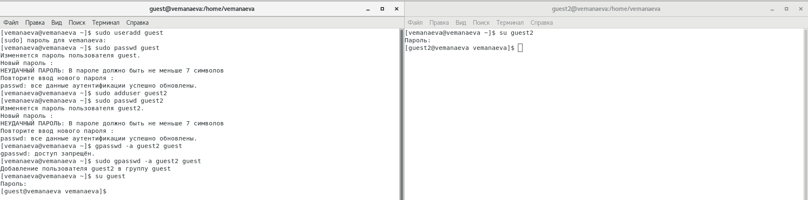
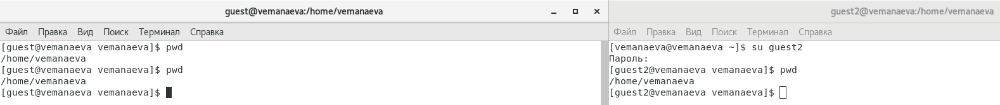
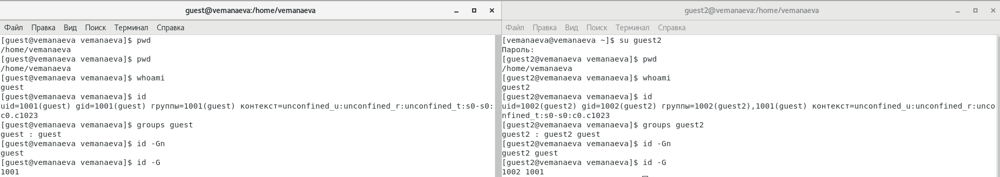

---
## Front matter
lang: ru-RU
title: "Лабораторная работа №3"
subtitle: "Дисциплина: Информационная безопасность"
author:
  - Манаева Варвара Евгеньевна.
institute:
  - Российский университет дружбы народов, Москва, Россия
date: 20 сентября 2023

## i18n babel
babel-lang: russian
babel-otherlangs: english

## Formatting pdf
toc: false
toc-title: Содержание
slide_level: 2
aspectratio: 169
section-titles: true
theme: metropolis
header-includes:
 - \metroset{progressbar=frametitle,sectionpage=progressbar,numbering=fraction}
 - '\makeatletter'
 - '\beamer@ignorenonframefalse'
 - '\makeatother'
---

# Цели и задачи работы

## Цель лабораторной работы

Получение практических навыков работы в консоли с атрибутами файлов, 
закрепление теоретических основ дискреционного разграничения доступа в современных системах с открытым кодом на базе ОС Linux.

## Задачи

1. Создать двух новых пользователей (гостевых аккаунтов) виртуальной машины;
2. Через гостевые аккаунту выполнить задания лабораторной работы;
3. Заполнить таблицы об уровнях доступа и действиях с файлами/директориями.

# Выполение лабораторной работы

## 1. В установленной ОС создаю учётную запись пользователя `guest`

{#fig:001 width=70%}

## 2. Задаём пароль для пользователя `guest`

{#fig:002 width=70%}

## 3. Аналогично пунктам 1 и 2 создаю пользователя `guest2`

{#fig:003 width=70%}

## 4. С помощью команды `gpasswd -a guest2 guest` добавляю пользователя `guest2` в группу `guest`

{#fig:004 width=70%}

## 5. Захожу в две консоли, в каждую от разных пользователей (`guest` и `guest2`)

{#fig:005 width=70%}

## 6. С помощью команды `pwd` определить, в какой директории находятся пользователи

{#fig:006 width=70%}

## 7. Уточняю информацию о пользователях с помощью команды `id`, определяем группы с помощью команды `groups` для обоих пользователей. Сравнивая выводы команд `groups`, `id -Gn` и `id -G`

{#fig:007 width=70%} 

## 7, продолжение.

По результатам выполнения команд `id -G`, `id -Gn` и `groups` видно, что первая выводит только ID групп, в которых состоит 
пользователь, вторая --- названия групп, в которых состоит пользователь, и третья выводит строку вида 

```
<username> : <groupname> <groupname> <groupname> <groupname>
```

## 8. Сравниваем информацию о пользователях с содержанием файла `/etc/group`

:::::::::::::: {.columns}
::: {.column width="50%"}

{#fig:108 width=70%}

:::
::: {.column width="50%"}

{#fig:208 width=70%}

:::
::::::::::::::

## От имени пользователя `guest2` регистрируем этого пользователя в группе `guest` командой `newgrp guest`

{#fig:009 width=70%}

## От имени пользователя `guest` разрешаем все действия для группы в папке `/home/guest`

{#fig:010 width=70%}

## От имени пользователя `guest` снимаем все атрибуты с директории `/home/guest/dir1` командой `chmod 000 dir1`

{#fig:011 width=70%}

## Заполняем таблицу «Установленные права и разрешённые действия»


: Отрывок из таблицы "Установленные права и разрешённые действия" {#tbl:access_1}

| Права директории            | Права файла | Создание файла | Удаление файла | Запись файла | Чтение файла | Смена директории | Просмотр файлов в директории | Переименование файла | Смена атрибутов файла |
|-----------------------------|-------------|----------------|----------------|--------------|--------------|------------------|------------------------------|----------------------|-----------------------|
| d----wx---                  | (000)       | +              | +              | -            | -            | +                | -                            | +                    | -                     |
| d----wx---                  | (010)       | +              | +              | -            | -            | +                | -                            | +                    | -                     |
| d----wx---                  | (020)       | +              | +              | +            | -            | +                | -                            | +                    | -                     |
| d----wx---                  | (030)       | +              | +              | +            | -            | +                | -                            | +                    | -                     |
| d----wx---                  | (040)       | +              | +              | -            | +            | +                | -                            | +                    | +                     |
| d----wx---                  | (050)       | +              | +              | -            | +            | +                | -                            | +                    | +                     |
| d----wx---                  | (060)       | +              | +              | +            | +            | +                | -                            | +                    | +                     |
| d----wx---                  | (070)       | +              | +              | +            | +            | +                | -                            | +                    | +                     |

## На основании заполненной таблицы определяю те или иные минимально необходимые права для выполнения операций внутри директории dir1


: Минимальные права для совершения операций {#tbl:access_2}

| Операция               | Минимальные права на директорию | Минимальные права на файл |
|------------------------|---------------------------------|---------------------------|
| Создание файла         | d----wx---                      | (000)                     |
| Удаление файла         | d----wx---                      | (000)                     |
| Чтение файла           | d-----x---                      | (040)                     |
| Запись в файл          | d-----x---                      | (020)                     |
| Переименование файла   | d----wx---                      | (000)                     |
| Создание поддиректории | d----wx---                      | (000)                     |
| Удаление поддиректории | d----wx---                      | (000)                     |

# Выводы по проделанной работе

## Вывод

В результате выполнения работы мы получили пракические навыки работы в консоли с атрибутами файлов и 
закрепили теоретические основы дискреционного разграничения доступа в современных системах на базе ОС Linux.

Были записаны скринкасты выполнения и защиты лабораторной работы.

