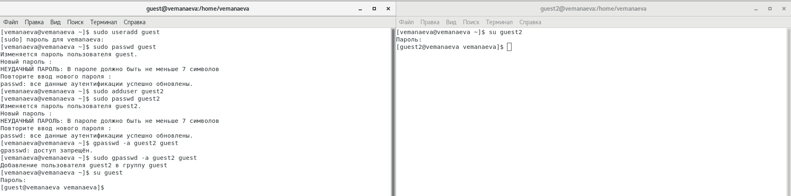
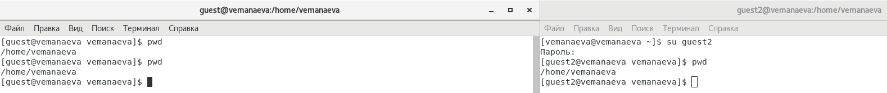
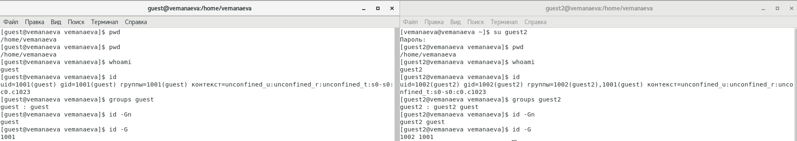

---
## Front matter
title: "Лабораторная работа №3"
subtitle: "Дисциплина: Информационная безопасность"
author: "Манаева Варвара Евгеньевна"

## Generic otions
lang: ru-RU
toc-title: "Содержание"

## Bibliography
bibliography: bib/cite.bib
csl: pandoc/csl/gost-r-7-0-5-2008-numeric.csl

## Pdf output format
toc: true # Table of contents
toc-depth: 2
lof: true # List of figures
lot: true # List of tables
fontsize: 12pt
linestretch: 1.5
papersize: a4
documentclass: scrreprt
## I18n polyglossia
polyglossia-lang:
  name: russian
  options:
	- spelling=modern
	- babelshorthands=true
polyglossia-otherlangs:
  name: english
## I18n babel
babel-lang: russian
babel-otherlangs: english
## Fonts
mainfont: PT Serif
romanfont: PT Serif
sansfont: PT Sans
monofont: PT Mono
mainfontoptions: Ligatures=TeX
romanfontoptions: Ligatures=TeX
sansfontoptions: Ligatures=TeX,Scale=MatchLowercase
monofontoptions: Scale=MatchLowercase,Scale=0.9
## Biblatex
biblatex: true
biblio-style: "gost-numeric"
biblatexoptions:
  - parentracker=true
  - backend=biber
  - hyperref=auto
  - language=auto
  - autolang=other*
  - citestyle=gost-numeric
## Pandoc-crossref LaTeX customization
figureTitle: "Рис."
tableTitle: "Таблица"
listingTitle: "Листинг"
lofTitle: "Список иллюстраций"
lotTitle: "Список таблиц"
lolTitle: "Листинги"
## Misc options
indent: true
header-includes:
  - \usepackage{indentfirst}
  - \usepackage{float} # keep figures where there are in the text
  - \floatplacement{figure}{H} # keep figures where there are in the text
---

# Техническое оснащение:

- Персональный компьютер с операционной системой Windows 10;
- Планшет для записи видеосопровождения и голосовых комментариев;
- Microsoft Teams, использующийся для записи скринкаста лабораторной работы;
- Приложение Pycharm для редактирования файлов формата *md*;
- *pandoc* для конвертации файлов отчётов и презентаций.

# Цели и задачи работы
## Цель

Получение практических навыков работы в консоли с атрибутами файлов,
закрепление теоретических основ дискреционного разграничения доступа в
современных системах с открытым кодом на базе ОС Linux.

## Задачи

1. Создать двух новых пользователей (гостевых аккаунтов) виртуальной машины;
2. Через гостевые аккаунту выполнить задания лабораторной работы;
3. Заполнить таблицы об уровнях доступа и действиях с файлами/директориями.

# Теоретическое введение [@b:linux]

Для разграничения действий над файлами определены три базовых права доступа (базовые разрешения):

- чтение r — «read»,
- запись w — «write» и
- выполнение х — «execute»,

соответствующие разрешению выполнять системные вызовы read, write и execve (точнее, системному вызову open с флагами O_RDONLY и O_WRONLY, но для простоты можно считать r — read, a w — write).

Каждое из базовых прав назначается на файл тому или иному пользователю или группе, разрешая соответствующую операцию.

В наследии классической UNIX определены только три субъекта, которым назначаются базовые права — пользователь-владелец (owner), группа-владелец (group owner) и все остальные (others). Совокупность их базовых прав называется режимом доступа (access mode) к файлу.

Базовое право может быть назначено r, w или х или отозвано —, поэтому в метаданных файла представляется одним битом, а для режима доступа требуется девять бит: по три бита прав на каждый из трех субъектов доступа.

Компактно режим доступа может быть записан соответствующим числом в восьмеричной системе счисления rw-r--r-- $\to$ $110100100_2$ $\to$ $644_8$.

# Выполнение лабораторной работы [@lab:3]

1. В установленной ОС создаю учётную запись пользователя `guest` (@fig:001)

{#fig:001 width=70%}

2. Задаём пароль для пользователя `guest` (@fig:002)

{#fig:002 width=70%}

3. Аналогично пунктам 1 и 2 создаю пользователя `guest2` (@fig:003)

{#fig:003 width=70%}

4. С помощью команды `gpasswd -a guest2 guest` добавляю пользователя `guest2` в группу `guest` (@fig:004)

{#fig:004 width=70%}

5. Захожу в две консоли, в каждую от разных пользователей (`guest` и `guest2`) (@fig:005)

{#fig:005 width=70%}

6. С помощью команды `pwd` определить, в какой директории находятся пользователи (@fig:006)

{#fig:006 width=70%}

7. Уточняю информацию о пользователях с помощью команды `id`, определяем группы с помощью команды `groups` для обоих
пользователей (@fig:007).

{#fig:007 width=70%}

По результатам выполнения команд `id -G`, `id -Gn` и `groups` видно, что первая выводит только ID групп, в которых состоит
пользователь, вторая --- названия групп, в которых состоит пользователь, и третья выводит строку вида 

```
<username> : <groupname> <groupname> <groupname> <groupname>
```

8. Сравниваем информацию о пользователях с содержанием файла `/etc/group` (@fig:108, @fig:208)

{#fig:108 width=70%}

{#fig:208 width=70%}

9. От имени пользователя `guest2` регистрируем этого пользователя в группе `guest` командой `newgrp guest` (@fig:009)

{#fig:009 width=70%}

10. От имени пользователя `guest` разрешаем все действия для группы в папке `/home/guest` (@fig:010)

{#fig:010 width=70%}

11. От имени пользователя `guest` снимаем все атрибуты с директории `/home/guest/dir1` командой `chmod 000 dir1` (@fig:011)

{#fig:011 width=70%}

Далее пробуем выполнять различные действия от лица пользователя `guest2` с папкой `dir1` в домашней директории 
пользователя `guest` и, по результатам выполнения, заполняем таблицы @tbl:access_1 и @tbl:access_2.

## Таблицы (@tbl:access_1 и @tbl:access_2)


: Установленные права и разрешённые действия {#tbl:access_1}

| Права директории            | Права файла   | Создание файла   | Удаление файла   | Запись файла   | Чтение файла   | Смена директории   | Просмотр файлов в директории   | Переименование файла   | Смена атрибутов файла   |
|-----------------------------|---------------|------------------|------------------|----------------|----------------|--------------------|--------------------------------|------------------------|-------------------------|
| d(000)                      | (000)         | -                | -                | -              | -              | -                  | -                              | -                      | -                       |
| d(000)                      | (010)         | -                | -                | -              | -              | -                  | -                              | -                      | -                       |
| d(000)                      | (020)         | -                | -                | -              | -              | -                  | -                              | -                      | -                       |
| d(000)                      | (030)         | -                | -                | -              | -              | -                  | -                              | -                      | -                       |
| d(000)                      | (040)         | -                | -                | -              | -              | -                  | -                              | -                      | -                       |
| d(000)                      | (050)         | -                | -                | -              | -              | -                  | -                              | -                      | -                       |
| d(000)                      | (060)         | -                | -                | -              | -              | -                  | -                              | -                      | -                       |
| d(000)                      | (070)         | -                | -                | -              | -              | -                  | -                              | -                      | -                       |
|-----------------------------| ------------- | ---------------- | ---------------- | -------------- | -------------- | ------------------ | ------------------------------ | ---------------------- | ----------------------- |
| d-----x---                  | (000)         | -                | -                | -              | -              | +                  | -                              | -                      | -                       |
| d-----x---                  | (010)         | -                | -                | -              | -              | +                  | -                              | -                      | -                       |
| d-----x---                  | (020)         | -                | -                | +              | -              | +                  | -                              | -                      | -                       |
| d-----x---                  | (030)         | -                | -                | +              | -              | +                  | -                              | -                      | -                       |
| d-----x---                  | (040)         | -                | -                | -              | +              | +                  | -                              | -                      | -                       |
| d-----x---                  | (050)         | -                | -                | -              | +              | +                  | -                              | -                      | -                       |
| d-----x---                  | (060)         | -                | -                | +              | +              | +                  | -                              | -                      | -                       |
| d-----x---                  | (070)         | -                | -                | +              | +              | +                  | -                              | -                      | -                       |
|-----------------------------| ------------- | ---------------- | ---------------- | -------------- | -------------- | ------------------ | ------------------------------ | ---------------------- | ----------------------- |
| d----w----                  | (000)         | -                | -                | -              | -              | -                  | -                              | -                      | -                       |
| d----w----                  | (010)         | -                | -                | -              | -              | -                  | -                              | -                      | -                       |
| d----w----                  | (020)         | -                | -                | -              | -              | -                  | -                              | -                      | -                       |
| d----w----                  | (030)         | -                | -                | -              | -              | -                  | -                              | -                      | -                       |
| d----w----                  | (040)         | -                | -                | -              | -              | -                  | -                              | -                      | -                       |
| d----w----                  | (050)         | -                | -                | -              | -              | -                  | -                              | -                      | -                       |
| d----w----                  | (060)         | -                | -                | -              | -              | -                  | -                              | -                      | -                       |
| d----w----                  | (070)         | -                | -                | -              | -              | -                  | -                              | -                      | -                       |
|-----------------------------| ------------- | ---------------- | ---------------- | -------------- | -------------- | ------------------ | ------------------------------ | ---------------------- | ----------------------- |
| d----wx---                  | (000)         | +                | +                | -              | -              | +                  | -                              | +                      | -                       |
| d----wx---                  | (010)         | +                | +                | -              | -              | +                  | -                              | +                      | -                       |
| d----wx---                  | (020)         | +                | +                | +              | -              | +                  | -                              | +                      | -                       |
| d----wx---                  | (030)         | +                | +                | +              | -              | +                  | -                              | +                      | -                       |
| d----wx---                  | (040)         | +                | +                | -              | +              | +                  | -                              | +                      | +                       |
| d----wx---                  | (050)         | +                | +                | -              | +              | +                  | -                              | +                      | +                       |
| d----wx---                  | (060)         | +                | +                | +              | +              | +                  | -                              | +                      | +                       |
| d----wx---                  | (070)         | +                | +                | +              | +              | +                  | -                              | +                      | +                       |
|-----------------------------| ------------- | ---------------- | ---------------- | -------------- | -------------- | ------------------ | ------------------------------ | ---------------------- | ----------------------- |
| d---r-----                  | (000)         | -                | -                | -              | -              | -                  | +                              | -                      | -                       |
| d---r-----                  | (010)         | -                | -                | -              | -              | -                  | +                              | -                      | -                       |
| d---r-----                  | (020)         | -                | -                | -              | -              | -                  | +                              | -                      | -                       |
| d---r-----                  | (030)         | -                | -                | -              | -              | -                  | +                              | -                      | -                       |
| d---r-----                  | (040)         | -                | -                | -              | -              | -                  | +                              | -                      | -                       |
| d---r-----                  | (050)         | -                | -                | -              | -              | -                  | +                              | -                      | -                       |
| d---r-----                  | (060)         | -                | -                | -              | -              | -                  | +                              | -                      | -                       |
| d---r-----                  | (070)         | -                | -                | -              | -              | -                  | +                              | -                      | -                       |
|-----------------------------| ------------- | ---------------- | ---------------- | -------------- | -------------- | ------------------ | ------------------------------ | ---------------------- | ----------------------- |
| d---r-x---                  | (000)         | -                | -                | -              | -              | +                  | +                              | -                      | -                       |
| d---r-x---                  | (010)         | -                | -                | -              | -              | +                  | +                              | -                      | -                       |
| d---r-x---                  | (020)         | -                | -                | +              | -              | +                  | +                              | -                      | -                       |
| d---r-x---                  | (030)         | -                | -                | +              | -              | +                  | +                              | -                      | -                       |
| d---r-x---                  | (040)         | -                | -                | -              | +              | +                  | +                              | -                      | -                       |
| d---r-x---                  | (050)         | -                | -                | -              | +              | +                  | +                              | -                      | -                       |
| d---r-x---                  | (060)         | -                | -                | +              | +              | +                  | +                              | -                      | -                       |
| d---r-x---                  | (070)         | -                | -                | +              | +              | +                  | +                              | -                      | -                       |
|-----------------------------| ------------- | ---------------- | ---------------- | -------------- | -------------- | ------------------ | ------------------------------ | ---------------------- | ----------------------- |
| d---rw----                  | (000)         | -                | -                | -              | -              | -                  | +                              | -                      | -                       |
| d---rw----                  | (010)         | -                | -                | -              | -              | -                  | +                              | -                      | -                       |
| d---rw----                  | (020)         | -                | -                | -              | -              | -                  | +                              | -                      | -                       |
| d---rw----                  | (030)         | -                | -                | -              | -              | -                  | +                              | -                      | -                       |
| d---rw----                  | (040)         | -                | -                | -              | -              | -                  | +                              | -                      | -                       |
| d---rw----                  | (050)         | -                | -                | -              | -              | -                  | +                              | -                      | -                       |
| d---rw----                  | (060)         | -                | -                | -              | -              | -                  | +                              | -                      | -                       |
| d---rw----                  | (070)         | -                | -                | -              | -              | -                  | +                              | -                      | -                       |
|-----------------------------| ------------- | ---------------- | ---------------- | -------------- | -------------- | ------------------ | ------------------------------ | ---------------------- | ----------------------- |
| d---rwx---                  | (000)         | +                | +                | -              | -              | +                  | +                              | +                      | -                       |
| d---rwx---                  | (010)         | +                | +                | -              | -              | +                  | +                              | +                      | -                       |
| d---rwx---                  | (020)         | +                | +                | +              | -              | +                  | +                              | +                      | -                       |
| d---rwx---                  | (030)         | +                | +                | +              | -              | +                  | +                              | +                      | -                       |
| d---rwx---                  | (040)         | +                | +                | -              | +              | +                  | +                              | +                      | +                       |
| d---rwx---                  | (050)         | +                | +                | -              | +              | +                  | +                              | +                      | +                       |
| d---rwx---                  | (060)         | +                | +                | +              | +              | +                  | +                              | +                      | +                       |
| d---rwx---                  | (070)         | +                | +                | +              | +              | +                  | +                              | +                      | +                       |


: Минимальные права для совершения операций {#tbl:access_2}

| Операция               | Минимальные права на директорию | Минимальные права на файл |
|------------------------|---------------------------------|--------------------------|
| Создание файла         | d----wx---                      | (000)                    |
| Удаление файла         | d----wx---                      | (000)                    |
| Чтение файла           | d-----x---                      | (040)                    |
| Запись в файл          | d-----x---                      | (020)                    |
| Переименование файла   | d----wx---                      | (000)                    |
| Создание поддиректории | d----wx---                      | (000)                    |
| Удаление поддиректории | d----wx---                      | (000)                    |

# Выводы по проделанной работе

## Сравнения таблиц @tbl:access_1 и @tbl:access_2 с аналогичными таблицами из лабораторной работы №2 [@lab:2].

Если сравнивать получившиеся результаты в виде сводных таблиц, то можно легко заметить, что права действуют по одним и тем же принципам
как в случае, если они выданы владельцу файла, так и в случае, если они даны пользователям из группы владельца файла. Главное, отслеживать,
какие права выданы пользователю, который пытается получить доступ к файлу, а уже исходя из этого легко предсказать, как себя поведёт
та или иная функция в зависимости от выданных прав.

## Общий вывод

В результате выполнения работы мы ознакомились с основными этапами установки виртуальных машин и их настроек, 
а также создали виртуальную среду для выполнения последующих лабораторных работ.

Были записаны скринкасты выполнения и защиты лабораторной работы.

Ссылки на скринкасты:

- [Выполнение, Youtube](https://youtu.be/IBSf9UaZ0vQ)
- [Выполнение, Rutube](https://rutube.ru/video/bca4b5e0368e0a72af94fd0d666ad193)
- [Защита презентации, Youtube](https://youtu.be/ZsuP1ZyQTwA)
- [Защита презентации, Rutube](https://rutube.ru/video/4a09789231449f04657732e7580d305e)

# Список литературы

::: {#refs}
:::
