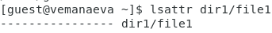
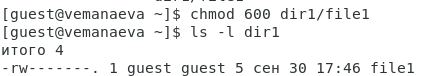
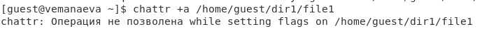
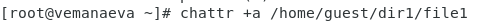
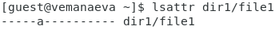
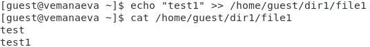
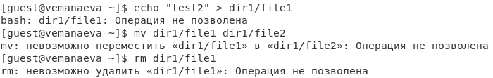
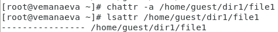
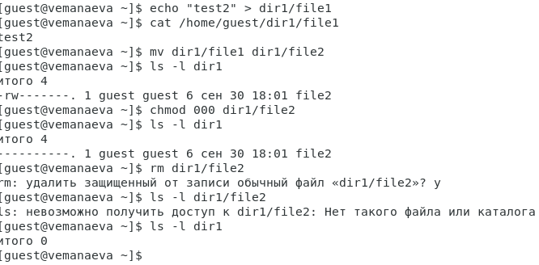

---
## Front matter
lang: ru-RU
title: "Лабораторная работа №4. Дискреционное разграничение прав в Linux. Расширенные атрибуты"
subtitle: "Дисциплина: Информационная безопасность"
author:
  - Манаева Варвара Евгеньевна.
institute:
  - Российский университет дружбы народов, Москва, Россия
date: 30 сентября 2023

## i18n babel
babel-lang: russian
babel-otherlangs: english

## Formatting pdf
toc: false
toc-title: Содержание
slide_level: 2
aspectratio: 169
section-titles: true
theme: metropolis
header-includes:
 - \metroset{progressbar=frametitle,sectionpage=progressbar,numbering=fraction}
 - '\makeatletter'
 - '\beamer@ignorenonframefalse'
 - '\makeatother'
---

# Цели и задачи работы

## Цель лабораторной работы

Получение практических навыков работы в консоли с расширенными атрибутами файлов.

## Задачи

- Совершим ряд операций с файлом, которому выдали расширенный атрибут `a`;
- Совершим ряд операций с файлом, которому выдали расширенный атрибут `i`;
- Сравним возможность выполнения различных операций с разными атрибутами.

# Выполение лабораторной работы

## От имени пользователя `guest` определим расширенные атрибуты файла `/home/guest/dir1/file1` командой `lsattr /home/guest/dir1/file1`

{#fig:001 width=80%} 

## Установим командой `chmod 600 file1` на файл `file1` права, разрешающие чтение и запись для владельца файла.

{#fig:002 width=80%}

## Попробуем установить на файл `/home/guest/dir1/file1` расширенный атрибут `a` от имени пользователя `guest` командой `chattr +a /home/guest/dir1/file1`

{#fig:003 width=80%}

## Зайдём на третью консоль с правами администратора и попробуем установить расширенный атрибут `a` на файл `/home/guest/dir1/file1` командой `chattr +a /home/guest/dir1/file1`

{#fig:004 width=80%}

## От пользователя `guest` проверьте правильность установления атрибута командой `lsattr /home/guest/dir1/file1`

{#fig:005 width=80%}

## Выполним дозапись в файл `file1` слова «test» командой `echo "test" /home/guest/dir1/file1`, после чего выполним чтение файла file1 командой `cat /home/guest/dir1/file1`

{#fig:006 width=80%}

## Попробуем удалить файл file1, стереть имеющуюся в нём информацию командой `echo "abcd" > /home/guest/dirl/file1` и переименовать файл

{#fig:007 width=80%}

## Попробуйте с помощью команды `chmod 000 file1` установить на файл `file1` права, например, запрещающие чтение и запись для владельца файла.

{#fig:008 width=80%}

Указания команды выполнить не удалось.

## Снимем расширенный атрибут a с файла `/home/guest/dirl/file1` от имени суперпользователя командой `chattr -a /home/guest/dir1/file1` и повторим неполучившиеся действия (1)

{#fig:009 width=70%}

## Снимем расширенный атрибут a с файла `/home/guest/dirl/file1` от имени суперпользователя командой `chattr -a /home/guest/dir1/file1` и повторим неполучившиеся действия (2)

{#fig:010 width=70%}

## Повтором аналогичные шаги с атрибутом `i` (1)

{#fig:011 width=70%}

## Повтором аналогичные шаги с атрибутом `i` (2)

{#fig:012 width=70%}

## Заполним таблицу на основании произведённых действий

: Возможность выполнения ряда операций с файлом при наличии расширенных атрибутов {#tbl:rasshirennye}

| Операция                    | С атрибутом "a" | Без атрибута "a" | С атрибутом "i" | Без атрибута "i" |
|-----------------------------|-----------------|------------------|-----------------|------------------|
| Запись в файл               | +               | +                | -               | +                |
| Чтение файла                | +               | +                | +               | +                |
| Удаление файла              | -               | +                | -               | +                |
| Удаление информации в файле | -               | +                | -               | +                |
| Переименование файла        | -               | +                | -               | +                |
| Смена атрибутов файла       | -               | +                | -               | +                |

# Выводы по проделанной работе

## Вывод

В результате выполнения работы мы повысили свои навыки использования интерфейса командой строки, познакомились на примерах с тем,
как используются основные и расширенные атрибуты при разграничении доступа. Имели возможность связать теорию дискреционного разделения
доступа (дискреционная политика безопасности) с её реализацией на практике в ОС Linux. Составили наглядные таблицы, поясняющие 
какие операции возможны при тех или иных установленных правах. Опробовали действие на практике расширенных атрибутов «а» и «i».

Были записаны скринкасты выполнения и защиты лабораторной работы.

