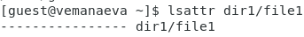
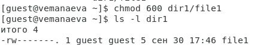
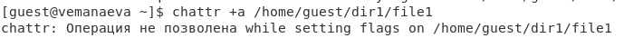
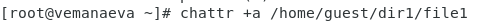
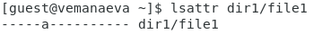
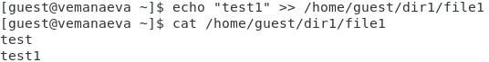
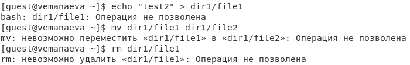
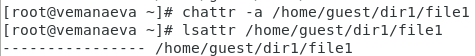
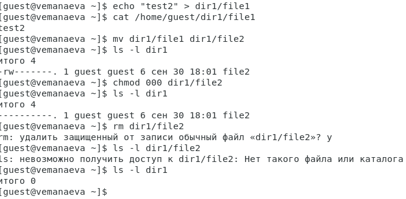

---
## Front matter
title: "Лабораторная работа №4"
subtitle: "Дисциплина: Информационная безопасность"
author: "Манаева Варвара Евгеньевна"

## Generic otions
lang: ru-RU
toc-title: "Содержание"

## Bibliography
bibliography: bib/cite.bib
csl: pandoc/csl/gost-r-7-0-5-2008-numeric.csl

## Pdf output format
toc: true # Table of contents
toc-depth: 2
lof: true # List of figures
lot: true # List of tables
fontsize: 12pt
linestretch: 1.5
papersize: a4
documentclass: scrreprt
## I18n polyglossia
polyglossia-lang:
  name: russian
  options:
	- spelling=modern
	- babelshorthands=true
polyglossia-otherlangs:
  name: english
## I18n babel
babel-lang: russian
babel-otherlangs: english
## Fonts
mainfont: PT Serif
romanfont: PT Serif
sansfont: PT Sans
monofont: PT Mono
mainfontoptions: Ligatures=TeX
romanfontoptions: Ligatures=TeX
sansfontoptions: Ligatures=TeX,Scale=MatchLowercase
monofontoptions: Scale=MatchLowercase,Scale=0.9
## Biblatex
biblatex: true
biblio-style: "gost-numeric"
biblatexoptions:
  - parentracker=true
  - backend=biber
  - hyperref=auto
  - language=auto
  - autolang=other*
  - citestyle=gost-numeric
## Pandoc-crossref LaTeX customization
figureTitle: "Рис."
tableTitle: "Таблица"
listingTitle: "Листинг"
lofTitle: "Список иллюстраций"
lotTitle: "Список таблиц"
lolTitle: "Листинги"
## Misc options
indent: true
header-includes:
  - \usepackage{indentfirst}
  - \usepackage{float} # keep figures where there are in the text
  - \floatplacement{figure}{H} # keep figures where there are in the text
---

# Техническое оснащение:

- Персональный компьютер с операционной системой Windows 10;
- Планшет для записи видеосопровождения и голосовых комментариев;
- Microsoft Teams, использующийся для записи скринкаста лабораторной работы;
- Приложение Pycharm для редактирования файлов формата *md*;
- *pandoc* для конвертации файлов отчётов и презентаций.

# Цели и задачи работы
## Цель

Получение практических навыков работы в консоли с расширенными атрибутами файлов.

## Задачи

- Совершим ряд операций с файлом, которому выдали расширенный атрибут `a`;
- Совершим ряд операций с файлом, которому выдали расширенный атрибут `i`;
- Сравним возможность выполнения различных операций с разными атрибутами.

# Теоретическое введение [@b:linux]

Расширенные атрибуты файловых объектов --- поддерживаемая некоторыми файловыми системами возможность 
ассоциировать с файловыми объектами произвольные метаданные. В отличие от обычных атрибутов файловых объектов (таких, как владелец,
права доступа, время создания и пр.), содержание расширенных атрибутов не специфицируется в файловой системе и может принимать любые значение.
С точки зрения реализации расширенные атрибуты представляют собой пары ключ:значение, ассоциированные с файловыми объектами.
Типичными применениями расширенных атрибутов является хранение таких данных, как автор документа, контрольные суммы, источник документа, информация для контроля доступа.

Каждый расширенный атрибут имеет имя вида `namespace.attrname`, при этом пространства имен namespace определяют назначение 
атрибута. Пространство, имен systen используется системными (ядерными) компонентами, например, для списков контроля доступа POSIX ACL.

Пространство имен `security` используется системными компонентами безопасности, в частности для хранения привилегий исполняемых 
программ (capabilities), и меток модуля принудительного контроля доступа SELinux.

Пространства имен `trusted` и `user` предназначены для атрибутов внеядерных компонент программ, выполняющихся привилегированным
и обычными пользователями соответственно.

: Информация о некоторых расширенных атрибутах {#tbl:info}

| Атрибуты | Информация об атрибуте                                                                                                                                                                                                                                                                                                                          |
|----------|-------------------------------------------------------------------------------------------------------------------------------------------------------------------------------------------------------------------------------------------------------------------------------------------------------------------------------------------------|
| `a`      | Файл с установленным атрибутом `a` можно открыть только в режиме добавления для записи. Только суперпользователь или процесс, обладающий возможностью CAP_LINUX_IMMUTABLE, может установить или очистить этот атрибут.                                                                                                                      |
| `i`      | Файл с атрибутом «i» не может быть изменён: его нельзя удалить или переименовать, нельзя создать ссылку на этот файл, большую часть метаданных файла нельзя изменить, и файл нельзя открыть в режиме записи. Только суперпользователь или процесс, обладающий возможностью CAP_LINUX_IMMUTABLE, может установить или очистить этот атрибут. |

# Выполнение лабораторной работы [@lab:4]

1. От имени пользователя `guest` определим расширенные атрибуты файла `/home/guest/dir1/file1` командой `lsattr /home/guest/dir1/file1`

{#fig:001 width=70%} 

2. Установим командой `chmod 600 file1` на файл `file1` права, разрешающие чтение и запись для владельца файла.

{#fig:002 width=70%}

3. Попробуем установить на файл `/home/guest/dir1/file1` расширенный атрибут `a` от имени пользователя `guest` командой `chattr +a /home/guest/dir1/file1`

{#fig:003 width=70%}

4. Зайдём на третью консоль с правами администратора и попробуем установить расширенный атрибут `a` на файл `/home/guest/dir1/file1` командой `chattr +a /home/guest/dir1/file1`

{#fig:004 width=70%}

5. От пользователя `guest` проверьте правильность установления атрибута командой `lsattr /home/guest/dir1/file1`

{#fig:005 width=70%}

6. Выполним дозапись в файл `file1` слова «test» командой `echo "test" >> /home/guest/dir1/file1`, после чего выполним чтение файла file1 командой `cat /home/guest/dir1/file1`

{#fig:006 width=70%}

7. Попробуем удалить файл file1, стереть имеющуюся в нём информацию командой `echo "abcd" > /home/guest/dirl/file1` и переименовать файл

{#fig:007 width=70%}

8. Попробуйте с помощью команды `chmod 000 file1` установить на файл `file1` права, например, запрещающие чтение и запись для владельца файла.

{#fig:008 width=70%}

Указания команды выполнить не удалось.

9. Снимем расширенный атрибут a с файла `/home/guest/dirl/file1` от имени суперпользователя командой `chattr -a /home/guest/dir1/file1` и повторим неполучившиеся действия

{#fig:009 width=70%}

{#fig:010 width=70%}

10. Повтором аналогичные шаги с атрибутом `i` и заполним таблицу на основании произведённых действий

{#fig:011 width=70%}

{#fig:012 width=70%}

: Возможность выполнения ряда операций с файлом при наличии расширенных атрибутов {#tbl:rasshirennye}

| Операция                    | С атрибутом "a" | Без атрибута "a" | С атрибутом "i" | Без атрибута "i" |
|-----------------------------|-----------------|------------------|-----------------|------------------|
| Запись в файл               | +               | +                | -               | +                |
| Чтение файла                | +               | +                | +               | +                |
| Удаление файла              | -               | +                | -               | +                |
| Удаление информации в файле | -               | +                | -               | +                |
| Переименование файла        | -               | +                | -               | +                |
| Смена атрибутов файла       | -               | +                | -               | +                |

# Выводы по проделанной работе

## Вывод

В результате выполнения работы мы повысили свои навыки использования интерфейса командой строки, познакомились на примерах с тем,
как используются основные и расширенные атрибуты при разграничении доступа. Имели возможность связать теорию дискреционного разделения
доступа (дискреционная политика безопасности) с её реализацией на практике в ОС Linux. Составили наглядные таблицы, поясняющие 
какие операции возможны при тех или иных установленных правах. Опробовали действие на практике расширенных атрибутов «а» и «i».

Были записаны скринкасты выполнения и защиты лабораторной работы.

Ссылки на скринкасты:

- [Выполнение, Youtube](https://youtu.be/4THXw94p6FY)
- [Выполнение, Rutube](https://rutube.ru/video/ab099f3ab125a2d9fccccd2b84d3aa4e)
- [Защита презентации, Youtube](https://youtu.be/xFmnCHeRNFU)
- [Защита презентации, Rutube](https://rutube.ru/video/cf8502ffd59b97c9b726fa7d069c5593)

# Список литературы

::: {#refs}
:::
