---
## Front matter
lang: ru-RU
title: "Лабораторная работа № 5. Дискреционное разграничение прав в Linux. Исследование влияния дополнительных атрибутов"
subtitle: "Дисциплина: Информационная безопасность"
author:
  - Манаева Варвара Евгеньевна.
institute:
  - Российский университет дружбы народов, Москва, Россия
date: 07 октября 2023

## i18n babel
babel-lang: russian
babel-otherlangs: english

## Formatting pdf
toc: false
toc-title: Содержание
slide_level: 2
aspectratio: 169
section-titles: true
theme: metropolis
header-includes:
 - \metroset{progressbar=frametitle,sectionpage=progressbar,numbering=fraction}
 - '\makeatletter'
 - '\beamer@ignorenonframefalse'
 - '\makeatother'
---

# Цели и задачи работы

## Цель лабораторной работы

Изучение механизмов изменения идентификаторов, применения SetUID- и Sticky-битов. Получение практических навыков работы
в консоли с дополнительными атрибутами. Рассмотрение работы механизма смены идентификатора процессов пользователей, а также
влияние бита Sticky на запись и удаление файлов.

## Задачи

- Настроить по заданию лабораторный стенд;
- Создать программы;
- Подробно разобрать влияние Sticky-бита на удаление и запись файлов.

# Выполение лабораторной работы
# Создание программ

## Войдём в систему от имени пользователя guest.

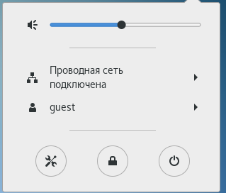{width=80% height=80%}

## Создадим программу simpleid.c:

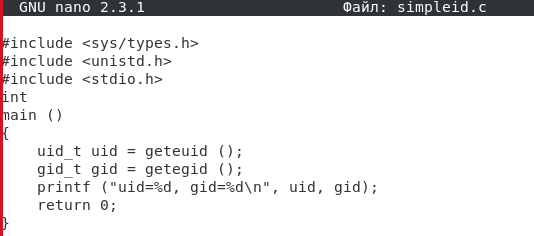{width=80% height=80%}

## Скомплилируем программу и убедимся, что файл программы создан, командой `gcc simpleid.c -o simpleid`

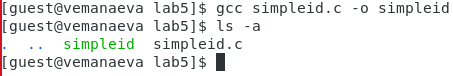{width=80% height=80%}

## Выполним программу simpleid командой `./simpleid`

{width=80% height=80%}

## Выполним системную программу id `id`

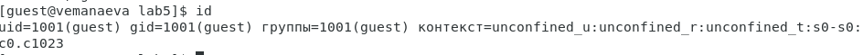{width=80% height=80%}

При использовании команды `id`, в отличие от использования написаной нами программы, выводится не только номер пользователя и номер группы,
но и имя пользователя и название группы (в скобках после соответствующих номеров), а также контекст.

## Усложним программу, добавив вывод действительных идентификаторов, и получившуюся программу назовём `simpleid2.c`.

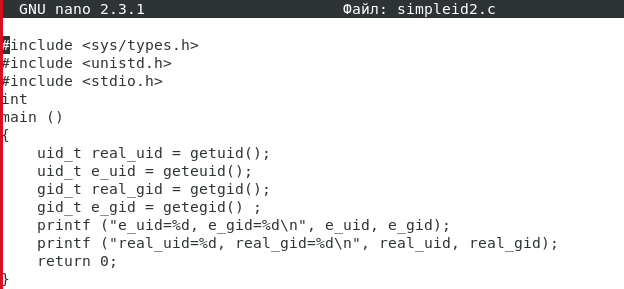{width=80% height=80%}

## Скомпилируем и запустим `simpleid2.c` командами:

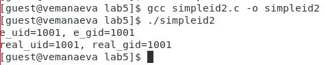{width=80% height=80%}

## Попробуем выполнить команды:

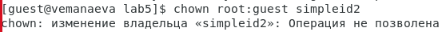{width=80% height=80%}

## Повысим временно свои права с помощью su и выполним эти команды.

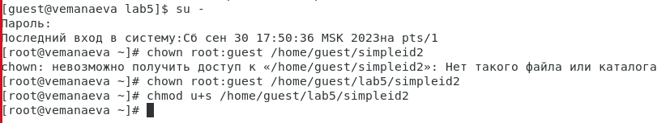{width=80% height=80%}

Команда `chown root:guest /home/guest/lab5/simpleid2` меняет владельца каталога на `root`, а группу каталога меняет на группу 
`guest` (вернее, оставляет без изменений). Команда chmod `u+s /home/guest/lab5/simpleid2` даёт права на выполнение от имени 
суперпользователя.

## Выполним проверку правильности установки новых атрибутов и смены владельца файла simpleid2 командой `ls -l simpleid2`

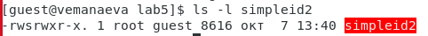{width=80% height=80%}

## Запустим simpleid2 и id

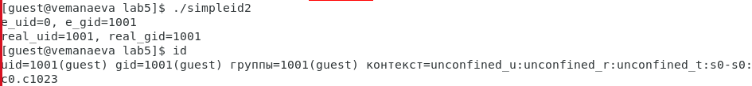{width=80% height=80%}

Команда `id`, в отличие от написаной программы, выводит только информацию о пользователе, который запросил запуск системной 
программы, в то время как `simpleid2` выводит информацию и о владельце файла, и о том, кто его запускает.

## Проделаем тоже самое относительно SetGID-бита.

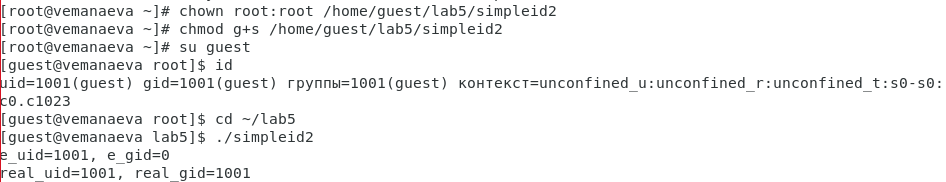{width=80% height=80%}

## Создадим программу `readfile.c`

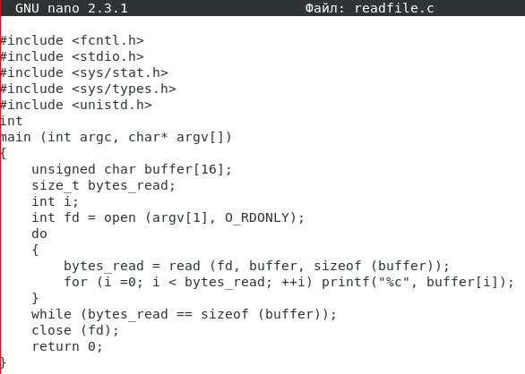{width=80% height=80%}

## Откомпилируем её командой `gcc readfile.c -o readfile`

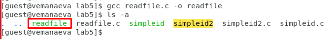{width=80% height=80%}

## Сменим владельца у файла readfile.c (или любого другого текстового файла в системе) и изменим права так, чтобы только суперпользователь (root) мог прочитать его, a guest не мог.

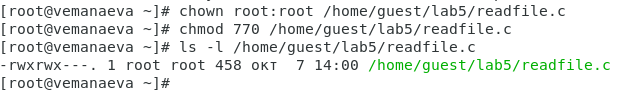{width=80% height=80%}

## Проверим, что пользователь guest не может прочитать файл `readfile.c` командой `cat /home/guest/lab5/readfile.c`

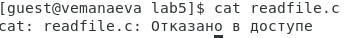{width=80% height=80%}

## Сменим у программы readfile владельца и установим SetUID-бит.

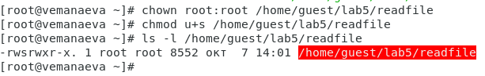{width=80% height=80%}

## Проверим, может ли программа readfile прочитать файл readfile.c

{width=80% height=80%}

Да, программа может читать данный файл.

## Проверим, может ли программа readfile прочитать файл /etc/shadow

{width=80% height=80%}

Да, программа может читать данный файл.

# Исследование Sticky-бита

## Выясним, установлен ли атрибут `Sticky` на директории `/tmp` командой `ls -l / | grep tmp`

{width=80% height=80%}

## От имени пользователя guest создадим файл `file01.txt` в директории `/tmp`со словом test командой `echo "test" > /tmp/file01.txt`

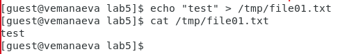{width=80% height=80%}

## Просмотрим атрибуты у только что созданного файла и разрешим чтение и запись для категории пользователей «все остальные» командами:

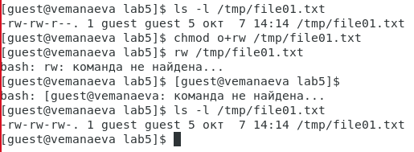{width=80% height=80%}

## От пользователя `guest2` (не являющегося владельцем) попробуем прочитать файл `/tmp/file01.txt` командой `cat /tmp/file01.txt`

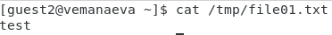{width=80% height=80%}

## От пользователя `guest2` попробуем дозаписать в файл `/tmp/file01.txt` слово test2 командой `echo "test2" >> /tmp/file01.txt`

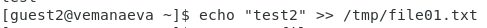{width=80% height=80%}

Операцию выполнить удалось.

## Проверим содержимое файла командой `cat /tmp/file01.txt`

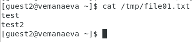{width=80% height=80%}

## От пользователя guest2 попробуем записать в файл `/tmp/file01.txt` слово test3, стерев при этом всю имеющуюся в файле информацию командой `echo "test3" > /tmp/file01.txt`

{width=80% height=80%}

Операцию выполнить удалось.

## Проверим содержимое файла командой `cat /tmp/file01.txt`

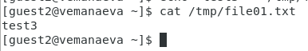{width=80% height=80%}

## От пользователя guest2 попробуем удалить файл `/tmp/file01.txt` командой `rm /tmp/fileOl.txt`

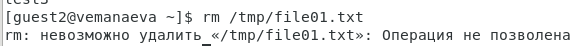{width=80% height=80%}

Файл удалить не удалось.

## Повысим свои права до суперпользователя следующей командой `su -` и выполним после этого команду, снимающую атрибут `t` (Sticky-бит) с директории `/tmp`, --- `chmod -t /tmp`

{width=80% height=80%}

## Покинем режим суперпользователя командой `exit`

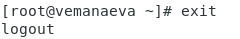{width=80% height=80%}

## От пользователя `guest2` проверим, что атрибута `t` у директории `/tmp` нет командой `ls -l / | grep tmp`

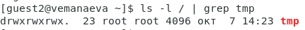{width=80% height=80%}

## Повторим шаги 4-9.

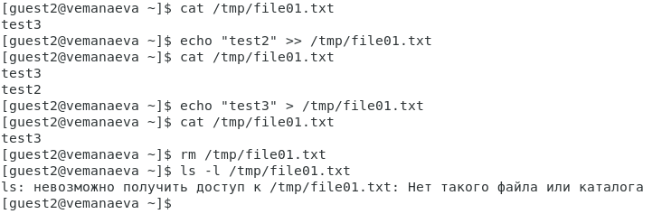{width=80% height=80%}

В результате изменения удалось удалить файл от имени пользователя, не являющегося его владельцем.

## Удалось удалить файл от имени пользователя, не являющегося его владельцем.

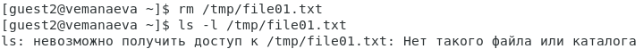{width=80% height=80%}

## Повысим свои права до суперпользователя и верните атрибут t на директорию /tmp командами:

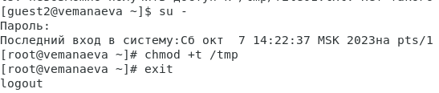{width=80% height=80%}

# Выводы по проделанной работе

## Вывод

В результате выполнения работы мы изучили механизм идентификаторов, применения SetUID- и Sticky-битов, получили практические 
навыки работы в консоли с дополнительными атрибутами, рассмотрели работы механизма смены идентификатора процессов пользователей,
а также посмотрели влияние бита Sticky на запись и удаление файлов.

Были записаны скринкасты выполнения и защиты лабораторной работы.

