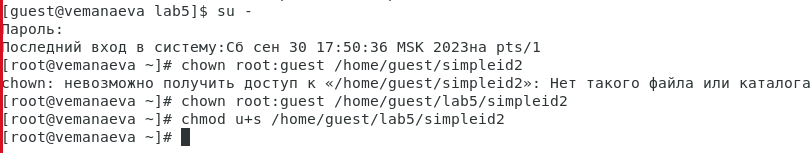
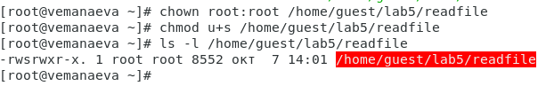

---
## Front matter
title: "Лабораторная работа № 5. Дискреционное разграничение прав в Linux. Исследование влияния дополнительных атрибутов"
subtitle: "Дисциплина: Информационная безопасность"
author: "Манаева Варвара Евгеньевна"

## Generic otions
lang: ru-RU
toc-title: "Содержание"

## Bibliography
bibliography: bib/cite.bib
csl: pandoc/csl/gost-r-7-0-5-2008-numeric.csl

## Pdf output format
toc: true # Table of contents
toc-depth: 2
lof: true # List of figures
lot: true # List of tables
fontsize: 12pt
linestretch: 1.5
papersize: a4
documentclass: scrreprt
## I18n polyglossia
polyglossia-lang:
  name: russian
  options:
	- spelling=modern
	- babelshorthands=true
polyglossia-otherlangs:
  name: english
## I18n babel
babel-lang: russian
babel-otherlangs: english
## Fonts
mainfont: PT Serif
romanfont: PT Serif
sansfont: PT Sans
monofont: PT Mono
mainfontoptions: Ligatures=TeX
romanfontoptions: Ligatures=TeX
sansfontoptions: Ligatures=TeX,Scale=MatchLowercase
monofontoptions: Scale=MatchLowercase,Scale=0.9
## Biblatex
biblatex: true
biblio-style: "gost-numeric"
biblatexoptions:
  - parentracker=true
  - backend=biber
  - hyperref=auto
  - language=auto
  - autolang=other*
  - citestyle=gost-numeric
## Pandoc-crossref LaTeX customization
figureTitle: "Рис."
tableTitle: "Таблица"
listingTitle: "Листинг"
lofTitle: "Список иллюстраций"
lotTitle: "Список таблиц"
lolTitle: "Листинги"
## Misc options
indent: true
header-includes:
  - \usepackage{indentfirst}
  - \usepackage{float} # keep figures where there are in the text
  - \floatplacement{figure}{H} # keep figures where there are in the text
---

# Техническое оснащение:

- Персональный компьютер с операционной системой Windows 10;
- Планшет для записи видеосопровождения и голосовых комментариев;
- Microsoft Teams, использующийся для записи скринкаста лабораторной работы;
- Приложение Pycharm для редактирования файлов формата *md*;
- *pandoc* для конвертации файлов отчётов и презентаций.

# Цели и задачи работы
## Цель

Изучение механизмов изменения идентификаторов, применения SetUID- и Sticky-битов. Получение практических навыков работы
в консоли с дополнительными атрибутами. Рассмотрение работы механизма смены идентификатора процессов пользователей, а также
влияние бита Sticky на запись и удаление файлов.

## Задачи

- Настроить по заданию лабораторный стенд;
- Создать программы;
- Подробно разобрать влияние Sticky-бита на удаление и запись файлов.

# Теоретическое введение [@b:linux]

Setuid – это бит разрешения, который позволяет пользователю запускать исполняемый файл с правами владельца этого файла.
Другими словами, использование этого бита позволяет нам поднять привилегии пользователя в случае, если это необходимо.
Классический пример использования этого бита в операционной системе это команда sudo. 

Принцип работы Setgid очень похож на setuid с отличием, что файл будет запускаться пользователем от имени группы, которая владеет файлом.

Последний специальный бит разрешения – это `Sticky Bit`. В случае, если этот бит установлен для папки, то файлы в этой папке
могут быть удалены только их владельцем. Пример использования этого бита в операционной системе это системная папка `/tmp`.
Эта папка разрешена на запись любому пользователю, но удалять файлы в ней могут только пользователи, являющиеся владельцами этих файлов.

# Выполнение лабораторной работы [@lab:5]
## Создание программ

1. Войдём в систему от имени пользователя guest. (@fig:101)

{#fig:101 width=80%}

2. Создадим программу simpleid.c (@fig:102):

```c
#include <sys/types.h>
#include <unistd.h>
#include <stdio.h>
int
main ()
{
    uid_t uid = geteuid ();
    gid_t gid = getegid ();
    printf ("uid=%d, gid=%d\n", uid, gid);
    return 0;
}
```

{#fig:102 width=80%}

3. Скомплилируем программу и убедимся, что файл программы создан, командой `gcc simpleid.c -o simpleid` (@fig:103)

{#fig:103 width=80%}

4. Выполним программу simpleid командой `./simpleid` (@fig:104)

{#fig:104 width=80%}

5. Выполним системную программу id `id` (@fig:105)

{#fig:105 width=80%}

При использовании команды `id`, в отличие от использования написаной нами программы, выводится не только номер пользователя и номер группы,
но и имя пользователя и название группы (в скобках после соответствующих номеров), а также контекст.

6. Усложним программу, добавив вывод действительных идентификаторов, и получившуюся программу назовём `simpleid2.c` (@fig:106).

```c
#include <sys/types.h>
#include <unistd.h>
#include <stdio.h>
int
main ()
{
    uid_t real_uid = getuid();
    uid_t e_uid = geteuid();
    gid_t real_gid = getgid();
    gid_t e_gid = getegid() ;
    printf ("e_uid=%d, e_gid=%d\n", e_uid, e_gid);
    printf ("real_uid=%d, real_gid=%d\n", real_uid, real_gid);
    return 0;
}
```

{#fig:106 width=80%}

7. Скомпилируем и запустим `simpleid2.c` командами (@fig:107):

```
gcc simpleid2.c -o simpleid2
./simpleid2
```

{#fig:107 width=80%}

8. Попробуем выполнить команды (@fig:108):

```
chown root:guest /home/guest/lab5/simpleid2
chmod u+s /home/guest/lab5/simpleid2
```

{#fig:108 width=80%}

9. Используйте sudo или повысьте временно свои права с помощью su и выполните эти команды. (@fig:109)

{#fig:109 width=80%}

Команда `chown root:guest /home/guest/lab5/simpleid2` меняет владельца каталога на `root`, а группу каталога меняет на группу
`guest` (вернее, оставляет без изменений). Команда chmod `u+s /home/guest/lab5/simpleid2` даёт права на выполнение от имени 
суперпользователя.

10. Выполним проверку правильности установки новых атрибутов и смены владельца файла simpleid2 командой `ls -l simpleid2` (@fig:110)

{#fig:110 width=80%}

11. Запустите simpleid2 и id (@fig:111)

```
id
./simpleid2
```

{#fig:111 width=80%}

Команда `id`, в отличие от написаной программы, выводит только информацию о пользователе, который запросил запуск системной
программы, в то время как `simpleid2` выводит информацию и о владельце файла, и о том, кто его запускает.

12. Проделайте тоже самое относительно SetGID-бита (@fig:112).

```
chown root:root /home/guest/lab5/simpleid2
chmod g+s /home/guest/lab5/simpleid2
id
./simpleid2
```

{#fig:112 width=80%}

13. Создайте программу `readfile.c` (@fig:113)

```c
#include <fcntl.h>
#include <stdio.h>
#include <sys/stat.h>
#include <sys/types.h>
#include <unistd.h>
int
main (int argc, char* argv[])
{
    unsigned char buffer[16];
    size_t bytes_read;
    int i;
    int fd = open (argv[1], O_RDONLY);
    do
    {
        bytes_read = read (fd, buffer, sizeof (buffer));
        for (i =0; i < bytes_read; ++i) printf("%c", buffer[i]);
    }
    while (bytes_read == sizeof (buffer));
    close (fd);
    return 0;
}
```

{#fig:113 width=80%}

14. Откомпилируйте её командой `gcc readfile.c -o readfile` (@fig:114)

{#fig:114 width=80%}

15. Смените владельца у файла readfile.c (или любого другого текстового файла в системе) и измените права так, чтобы 
только суперпользователь (root) мог прочитать его, a guest не мог (@fig:115).

```
chown root:root /home/guest/lab5/readfile.c
chmod 770 /home/guest/lab5/readfile.c
```

{#fig:115 width=80%}

16. Проверьте, что пользователь guest не может прочитать файл `readfile.c` командой `cat /home/guest/lab5/readfile.c` (@fig:116)

{#fig:116 width=80%}

17. Смените у программы readfile владельца и установите SetUID-бит (@fig:117).

```
chown root:root /home/guest/lab5/readfile
chmod u+s /home/guest/lab5/readfile
```

{#fig:117 width=80%}

18. Проверьте, может ли программа readfile прочитать файл readfile.c (@fig:118)

{#fig:118 width=80%}

Да, программа может читать данный файл.

19. Проверьте, может ли программа readfile прочитать файл /etc/shadow (@fig:119)

{#fig:119 width=80%}

Да, программа может читать данный файл.


## Исследование Sticky-бита

1. Выясним, установлен ли атрибут `Sticky` на директории `/tmp` командой `ls -l / | grep tmp` (@fig:201)

{#fig:201 width=80%}

2. От имени пользователя guest создадим файл `file01.txt` в директории `/tmp`со словом test командой `echo "test" > /tmp/file01.txt` (@fig:202)

{#fig:202 width=80%}

3. Просмотрим атрибуты у только что созданного файла и разрешим чтение и запись для категории пользователей «все остальные» командами (@fig:203):
 
```
ls -l /tmp/file01.txt
chmod o+rw /tmp/file01.txt
ls -l /tmp/file01.txt
```

{#fig:203 width=80%}

4. От пользователя `guest2` (не являющегося владельцем) попробуем прочитать файл `/tmp/file01.txt` командой `cat /tmp/file01.txt` (@fig:204)

{#fig:204 width=80%}

5. От пользователя `guest2` попробуем дозаписать в файл `/tmp/file01.txt` слово test2 командой `echo "test2" >> /tmp/file01.txt` (@fig:205)

{#fig:205 width=80%}

Операцию выполнить удалось.

6. Проверим содержимое файла командой `cat /tmp/file01.txt` (@fig:206)

{#fig:206 width=80%}

7. От пользователя guest2 попробуем записать в файл `/tmp/file01.txt` слово test3, стерев при этом всю имеющуюся в файле информацию командой
`echo "test3" > /tmp/file01.txt` (@fig:207)

{#fig:207 width=80%}

Операцию выполнить удалось.

8. Проверим содержимое файла командой `cat /tmp/file01.txt` (@fig:208)

{#fig:208 width=80%}

9. От пользователя guest2 попробуем удалить файл `/tmp/file01.txt` командой `rm /tmp/fileOl.txt` (@fig:209)

{#fig:209 width=80%}

Файл удалить не удалось.

10. Повысим свои права до суперпользователя следующей командой `su -` и выполним после этого команду, снимающую 
атрибут `t` (Sticky-бит) с директории `/tmp`, --- `chmod -t /tmp` (@fig:210)

{#fig:210 width=80%}

11. Покинем режим суперпользователя командой `exit` (@fig:211)

{#fig:211 width=80%}

12. От пользователя `guest2` проверим, что атрибута `t` у директории `/tmp` нет командой `ls -l / | grep tmp` (@fig:212)

{#fig:212 width=80%}

13. Повторим шаги 4-9. (@fig:213)

{#fig:213 width=80%}

В результате изменения удалось удалить файл от имени пользователя, не являющегося его владельцем.

14. Удалось удалить файл от имени пользователя, не являющегося его владельцем (@fig:214).

{#fig:214 width=80%}

15. Повысим свои права до суперпользователя и верните атрибут t на директорию /tmp командами (@fig:215):

```
su -
chmod +t /tmp
exit
```

{#fig:215 width=80%}

# Выводы по проделанной работе

## Вывод

В результате выполнения работы мы изучили механизм идентификаторов, применения SetUID- и Sticky-битов, получили практические 
навыки работы в консоли с дополнительными атрибутами, рассмотрели работы механизма смены идентификатора процессов пользователей,
а также посмотрели влияние бита Sticky на запись и удаление файлов.

Были записаны скринкасты выполнения и защиты лабораторной работы.

Ссылки на скринкасты:

- [Выполнение, Youtube](https://youtu.be/vok8NShubfQ)
- [Выполнение, Rutube](https://rutube.ru/video/aa54f3de5171360a1705a9ccc282906d)
- [Защита презентации, Youtube](https://youtu.be/eqUCWLUuITk)
- [Защита презентации, Rutube](https://rutube.ru/video/ccf4a695cc15fe32f969f33d74a6dab3)

# Список литературы

::: {#refs}
:::
