---
## Front matter
lang: ru-RU
title: "Лабораторная работа №6"
subtitle: "Дисциплина: Информационная безопасность"
author:
  - Манаева Варвара Евгеньевна.
institute:
  - Российский университет дружбы народов, Москва, Россия
date: 14 октября 2023

## i18n babel
babel-lang: russian
babel-otherlangs: english

## Formatting pdf
toc: false
toc-title: Содержание
slide_level: 2
aspectratio: 169
section-titles: true
theme: metropolis
header-includes:
 - \metroset{progressbar=frametitle,sectionpage=progressbar,numbering=fraction}
 - '\makeatletter'
 - '\beamer@ignorenonframefalse'
 - '\makeatother'
---

# Цели и задачи работы
## Цель

Развить навыки администрирования ОС Linux. Получить первое практическое знакомство с технологией SELinux. Проверить работу 
SELinx на практике совместно с веб-сервером `Apache`.

## Задачи

1. Подготовить лабораторный стенд;
2. Запустить `Apache` в системе;
3. Создать небольшой веб-сервер;
4. Посмотреть различные варианты настроек сервера и изучить реакции на изменение этих настроек.

# Выполнение лабораторной работы

## Войдите в систему с полученными учётными данными и убедитесь, что SELinux работает в режиме enforcing политики targeted с помощью команды sestatus. 

```
sestatus
```

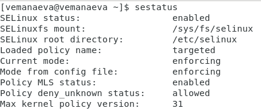{#fig:001 width=80%}

## Обратимся с помощью браузера к веб-серверу, запущенному на компьютере, и убедимся, что последний работает 

```
sudo systemctl start httpd
service httpd status
```

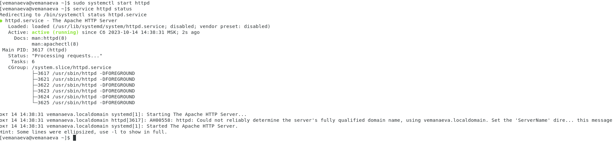{#fig:002 width=80%}

## Найдём веб-сервер `Apache` в списке процессов и определим его контекст безопасности 

```
ps auxZ | grep httpd
ps -eZ | grep httpd
```

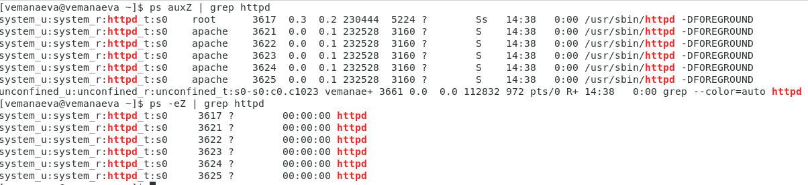{#fig:003 width=80%}

## Посмотрим текущее состояние переключателей SELinux для `Apache` 

```
sestatus -bigrep httpd
```

{#fig:004 width=80%}

## Определим тип файлов и поддиректорий, находящихся в директории `/var/www` 

```
ls -lZ /var/www
```

{#fig:006 width=80%}

## Определим тип файлов, находящихся в директории `/var/www/html` 

```
ls -lZ /var/www/html
```

{#fig:007 width=80%}

## Определим круг пользователей, которым разрешено создание файлов в директории `/var/www/html` (только суперпользователь) 

```
ls -l /var/www
```

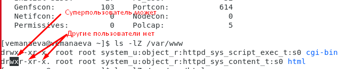{#fig:008 width=80%}

## Создадим от имени суперпользователя html-файл `/var/www/html/test.html` 

```
sudo nano /var/www/html/test.html
```

```hmtl
<html>
<body>test</body>
</hmtl>
```

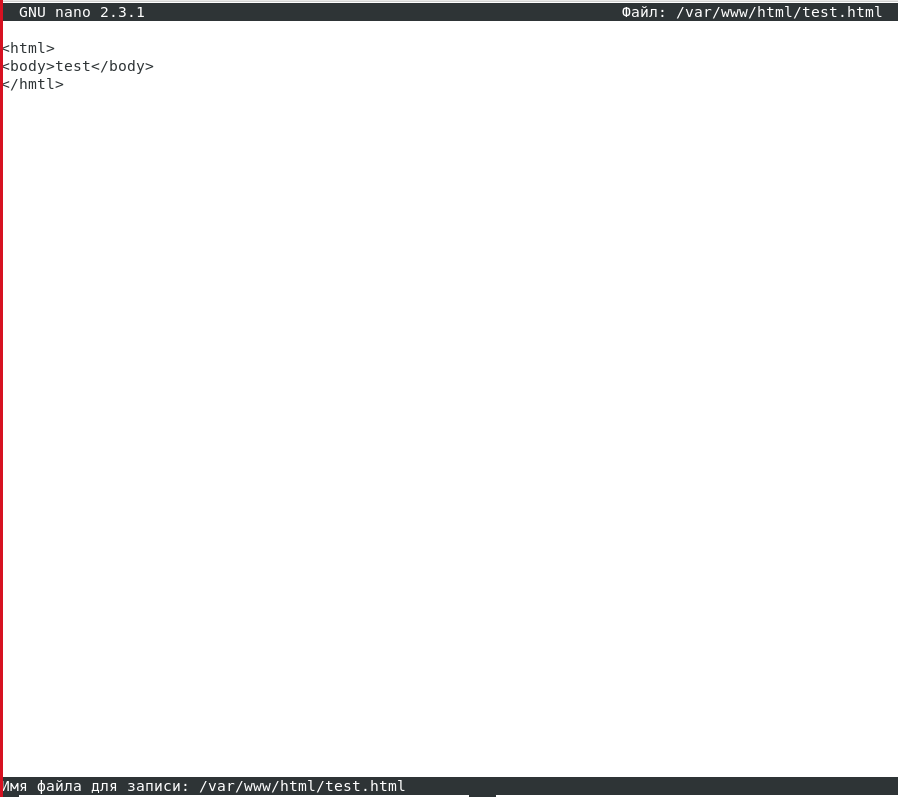{#fig:009 width=80%}

## Проверим контекст созданного файла. 

```
ls -Z /var/www/html/test.html
```

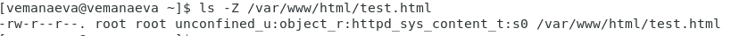{#fig:0010 width=80%}

## Обратимся к файлу через веб-сервер, введя в браузере адрес "http://127.0.0.1/test.html". Убедимся, что файл был успешно отображён. 

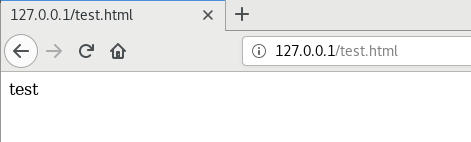{#fig:0011 width=80%}

## Измените контекст файла `/var/www/html/test.html` с httpd_sys_content_t на любой другой, к которому процесс httpd не должен иметь доступа 

```
sudo chcon -t samba_share_t /var/www/html/test.html
ls -Z /var/www/html/test.html
```

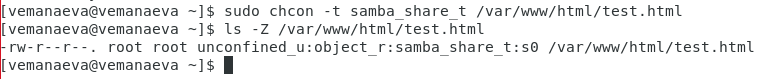{#fig:0013 width=80%}

## Попробуем ещё раз получить доступ к файлу через веб-сервер, введя в браузере адрес "http://127.0.0.1/test.html". И получаем сообщение об ошибке Forbidden. 

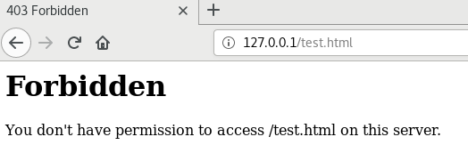{#fig:0014 width=80%}

## Проанализируем ситуацию. Просмотрим log-файлы веб-сервера Apache. 

```
ls -l /var/www/html/test.html
tail /var/log/messages

```

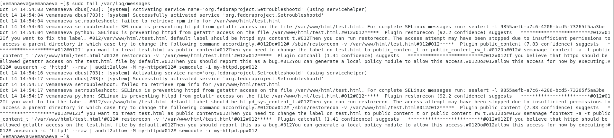{#fig:0015 width=80%}

## Выполним команду `semanage port -a -t http_port_t -р tcp 81`. После этого проверим список портов. Убедимся, что порт 81 появился в списке. 

```
sudo semanage port -a -t http_port_t --proto tcp 81
semanage port -l | grep http_port_t
```

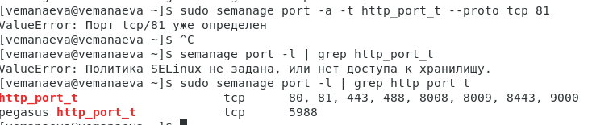{#fig:0019 width=80%}

## Вернём контекст `httpd_sys_cоntent__t` к файлу `/var/www/html/test.html`.

После этого попробуем получить доступ к файлу через веб-сервер, введя в браузере адрес http://127.0.0.1:81/test.html. 

```
chcon -t httpd_sys_content_t /var/www/html/test.html
```

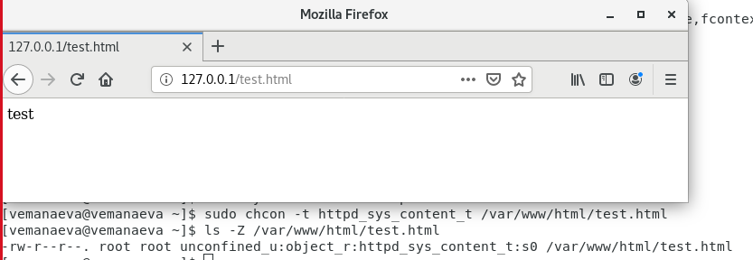{#fig:0021 width=80%}

# Выводы по проделанной работе

## Вывод

В результате выполнения работы мы развили навыки администрирования ОС Linux, получили первое практическое знакомство с 
технологией SELinux и проверили работу SELinx на практике совместно с веб-сервером `Apache`.

Были записаны скринкасты выполнения и защиты лабораторной работы.

