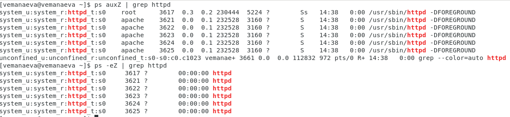
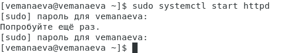

---
## Front matter
title: "Лабораторная работа №6"
subtitle: "Дисциплина: Информационная безопасность"
author: "Манаева Варвара Евгеньевна"

## Generic otions
lang: ru-RU
toc-title: "Содержание"

## Bibliography
bibliography: bib/cite.bib
csl: pandoc/csl/gost-r-7-0-5-2008-numeric.csl

## Pdf output format
toc: true # Table of contents
toc-depth: 2
lof: true # List of figures
lot: true # List of tables
fontsize: 12pt
linestretch: 1.5
papersize: a4
documentclass: scrreprt
## I18n polyglossia
polyglossia-lang:
  name: russian
  options:
	- spelling=modern
	- babelshorthands=true
polyglossia-otherlangs:
  name: english
## I18n babel
babel-lang: russian
babel-otherlangs: english
## Fonts
mainfont: PT Serif
romanfont: PT Serif
sansfont: PT Sans
monofont: PT Mono
mainfontoptions: Ligatures=TeX
romanfontoptions: Ligatures=TeX
sansfontoptions: Ligatures=TeX,Scale=MatchLowercase
monofontoptions: Scale=MatchLowercase,Scale=0.9
## Biblatex
biblatex: true
biblio-style: "gost-numeric"
biblatexoptions:
  - parentracker=true
  - backend=biber
  - hyperref=auto
  - language=auto
  - autolang=other*
  - citestyle=gost-numeric
## Pandoc-crossref LaTeX customization
figureTitle: "Рис."
tableTitle: "Таблица"
listingTitle: "Листинг"
lofTitle: "Список иллюстраций"
lotTitle: "Список таблиц"
lolTitle: "Листинги"
## Misc options
indent: true
header-includes:
  - \usepackage{indentfirst}
  - \usepackage{float} # keep figures where there are in the text
  - \floatplacement{figure}{H} # keep figures where there are in the text
---

# Техническое оснащение:

- Персональный компьютер с операционной системой Windows 10;
- Планшет для записи видеосопровождения и голосовых комментариев;
- Microsoft Teams, использующийся для записи скринкаста лабораторной работы;
- Приложение Pycharm для редактирования файлов формата *md*;
- *pandoc* для конвертации файлов отчётов и презентаций.

# Цели и задачи работы
## Цель

Развить навыки администрирования ОС Linux. Получить первое практическое знакомство с технологией SELinux. Проверить работу
SELinx на практике совместно с веб-сервером `Apache`.

## Задачи

1. Подготовить лабораторный стенд;
2. Запустить `Apache` в системе;
3. Создать небольшой веб-сервер;
4. Посмотреть различные варианты настроек сервера и изучить реакции на изменение этих настроек.

# Теоретическое введение и подготовка лабораторного стенда

HTTP-сервер Apache — самый широко используемый веб-сервер в мире. Он имеет множество мощных функций, включая динамически
загружаемые модули, надежную поддержку различных медиаформатов и интеграцию с другим популярным программным обеспечением.

Apache доступен в используемых по умолчанию репозиториях программного обеспечения CentOS, т. е. вы можете установить его с помощью менеджера пакетов `yum`.

Порядок настройки машины для использования `Apache`:

```
sudo yum update httpd
sudo yum install httpd
sudo yum install firewalld
sudo systemctl start firewalld
sudo firewall-cmd --permanent --add-service=ssh
sudo firewall-cmd --permanent --add-service=http
sudo firewall-cmd --permanent --add-service=https
sudo firewall-cmd --reload
sudo systemctl enable firewalld
```

В файле `/etc/httpd/httpd.conf` необходимо задать:

```
ServerName test.ru
```

Также необходимо проследить, чтобы пакетный фильтр был отключён. Отключить фильтр можно командами:

```
sudo iptables -F
sudo iptables -P INPUT ACCEPT iptables -P OUTPUT ACCEPT
```

# Выполнение лабораторной работы [@lab:6]

1. Войдите в систему с полученными учётными данными и убедитесь, что SELinux работает в режиме enforcing политики targeted
с помощью команды sestatus. (@fig:001)

```
sestatus
```

{#fig:001 width=80%}

2. Обратимся с помощью браузера к веб-серверу, запущенному на компьютере, и убедимся, что последний работает (@fig:002)

```
sudo systemctl start httpd
service httpd status
```

{#fig:002 width=80%}

3. Найдём веб-сервер `Apache` в списке процессов и определим его контекст безопасности (@fig:003)

```
ps auxZ | grep httpd
ps -eZ | grep httpd
```

{#fig:003 width=80%}

4. Посмотрим текущее состояние переключателей SELinux для `Apache` (@fig:004)

```
sestatus -bigrep httpd
```

{#fig:004 width=80%}

5. Посмотрим статистику по политике, а также определим множество пользователей, ролей и типов (@fig:005)

```
seinfo
```

{#fig:005 width=80%}

6. Определим тип файлов и поддиректорий, находящихся в директории `/var/www` (@fig:006)

```
ls -lZ /var/www
```

{#fig:006 width=80%}

7. Определим тип файлов, находящихся в директории `/var/www/html` (@fig:007)

```
ls -lZ /var/www/html
```

{#fig:007 width=80%}

8. Определим круг пользователей, которым разрешено создание файлов в директории `/var/www/html` (только суперпользователь) (@fig:008)

```
ls -l /var/www
```

{#fig:008 width=80%}

9. Создадим от имени суперпользователя html-файл `/var/www/html/test.html` (@fig:009)

```
sudo nano /var/www/html/test.html
```

```hmtl
<html>
<body>test</body>
</hmtl>
```

{#fig:009 width=80%}

10. Проверим контекст созданного файла. (@fig:0010)

```
ls -Z /var/www/html/test.html
```

{#fig:0010 width=80%}

11. Обратимся к файлу через веб-сервер, введя в браузере адрес "http://127.0.0.1/test.html". Убедимся, что файл был
успешно отображён. (@fig:0011)

{#fig:0011 width=80%}

12. Изучим справку и выясните, какие контексты файлов определены для httpd. Сопоставим их с типом файла test.html, проверив контекст файла (@fig:0012)

```
man httpd_selinux
ls -Z /var/www/html/test.html
```

{#fig:0012 width=80%}

13. Измените контекст файла `/var/www/html/test.html` с httpd_sys_content_t на любой другой, к которому процесс httpd не должен 
иметь доступа (@fig:0013)

```
sudo chcon -t samba_share_t /var/www/html/test.html
ls -Z /var/www/html/test.html
```

{#fig:0013 width=80%}

14. Попробуем ещё раз получить доступ к файлу через веб-сервер, введя в браузере адрес "http://127.0.0.1/test.html". И получаем сообщение об ошибке Forbidden. (@fig:0014)

{#fig:0014 width=80%}

15. Проанализируем ситуацию. Просмотрим log-файлы веб-сервера Apache. (@fig:0015)

```
ls -l /var/www/html/test.html
tail /var/log/messages

```

{#fig:0015 width=80%}

16. Запустим веб-сервер Apache на прослушивание ТСР-порта 81 (а не 80, как рекомендует IANA и прописано в /etc/services).
Для этого в файле /etc/httpd/httpd.conf найдите строчку Listen 80 и замените её на Listen 81 (@fig:0016)

```
nano /etc/httpd/httpd.conf
```

{#fig:0016 width=80%}

17. Выполним перезапуск веб-сервера Apache (@fig:0017)

```
sudo systemctl start httpd
```

{#fig:0017 width=80%}

18. Проанализируем лог-файлы `/var/log/messages`. Также просмотрим файлы `/var/log/http/error_log`, `/var/log/http/access_log`
и `/var/log/audit/audit.log` и выясним, в каких файлах появились записи (@fig:0018)

```
tail /var/log/messages
tail /var/log/http/error_log
tail /var/log/http/access_log
tail /var/log/audit/audit.log
```

{#fig:0018 width=80%}
{#fig:1018 width=80%}
{#fig:2018 width=80%}
{#fig:3018 width=80%}

19. Выполним команду `semanage port -a -t http_port_t -р tcp 81`. После этого проверим список портов. Убедимся, что порт 81 появился в списке. (@fig:0019)

```
sudo semanage port -a -t http_port_t --proto tcp 81
semanage port -l | grep http_port_t
```

{#fig:0019 width=80%}

20. Пробуем запустить веб-сервер Apache ещё раз. И он работает. (@fig:0020)

```
sudo systemctl start httpd
```

{#fig:0020 width=80%}

21. Вернём контекст `httpd_sys_cоntent__t` к файлу `/var/www/html/test.html`.
После этого попробуем получить доступ к файлу через веб-сервер, введя в браузере адрес http://127.0.0.1:81/test.html. (@fig:0021)

```
chcon -t httpd_sys_content_t /var/www/html/test.html
```

{#fig:0021 width=80%}

22. Исправим обратно конфигурационный файл apache, вернув Listen 80. (@fig:0022)

```
nano /etc/httpd/httpd.conf
```

{#fig:0022 width=80%}

23. Удалим привязку http_port_t к 81 порту и проверим, что порт 81 удалён.(@fig:0023)

```
semanage port -d -t http_port_t -p tcp 81
```

{#fig:0023 width=80%}

24. Удалим файл `/var/www/html/test.html` командой (@fig:0024)

```
rm /var/www/html/test.html
```

{#fig:0024 width=80%}


# Выводы по проделанной работе

## Вывод

В результате выполнения работы мы развили навыки администрирования ОС Linux, получили первое практическое знакомство с 
технологией SELinux и проверили работу SELinx на практике совместно с веб-сервером `Apache`.

Были записаны скринкасты выполнения и защиты лабораторной работы.

Ссылки на скринкасты:

- [Выполнение, Youtube](https://youtu.be/glRNW5eHxy4)
- [Выполнение, Rutube](https://rutube.ru/video/2ad492d2a864812e943cd7cc99cba76b/)
- [Защита презентации, Youtube](https://youtu.be/hAC2qCEJLxE)
- [Защита презентации, Rutube](https://rutube.ru/video/23a39ff1f64eee6a60e286136a3e8d00/)

# Список литературы

::: {#refs}
:::
