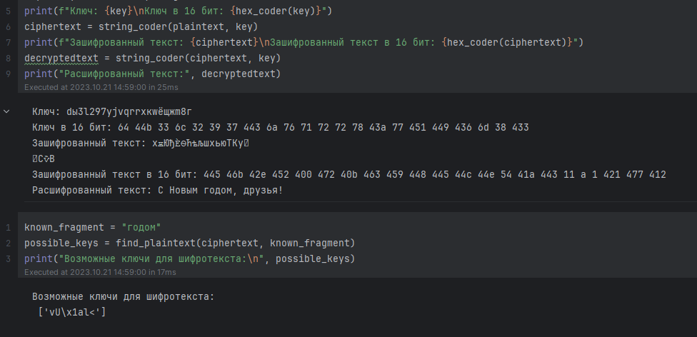

---
## Front matter
lang: ru-RU
title: "Лабораторная работа №7. Элементы криптографии. Однократное гаммирование"
subtitle: "Дисциплина: Информационная безопасность"
author:
  - Манаева Варвара Евгеньевна.
institute:
  - Российский университет дружбы народов, Москва, Россия
date: 21 октября 2023

## i18n babel
babel-lang: russian
babel-otherlangs: english

## Formatting pdf
toc: false
toc-title: Содержание
slide_level: 2
aspectratio: 169
section-titles: true
theme: metropolis
header-includes:
 - \metroset{progressbar=frametitle,sectionpage=progressbar,numbering=fraction}
 - '\makeatletter'
 - '\beamer@ignorenonframefalse'
 - '\makeatother'
---

# Цели и задачи работы

## Цель лабораторной работы

Изучение механизма шифрования гаммирование как простейшего варианта системы шифрования с закрытым ключом.

## Задачи

Нужно подобрать ключ, чтобы получить сообщение «С Новым Годом, друзья!». Требуется разработать приложение, позволяющее шифровать и дешифровать данные в режиме однократного гаммирования. Приложение должно:

1. Определить вид шифротекста при известном ключе и известном открытом тексте.
2. Определить ключ, с помощью которого шифротекст может быть преобразован в некоторый фрагмент текста, представляющий собой один из возможных вариантов прочтения открытого текста.

# Код

## Создание ключа

```python
def key_create(s, alf):
    k = ''.join(random.choice(alf) for i in range(s))
    return k
```

## Кодировка в шестнадцатиричный вид

```python
def hex_coder(cod):
    return ' '.join(hex(ord(i))[2:] for i in cod)
```

## Шифрование/дешифрование текста

```python
def string_coder(text, k, i_num):
    if i_num == 1:
        return ''.join(chr(ord(c) ^ ord(k)) for c, k in zip(text, k))
    else:
        return [''.join(chr(ord(c) ^ ord(k)) for c, k in zip(t, k)) for t in text]
```

## Поиск ключа по тексту

```python
def find_key(cypher, texts, s):
    possible_keys = []
    for f in range(len(texts)):
        for i in range(len(cypher[f]) - s + 1):
            key = [chr(ord(c) ^ ord(k)) for c, k in zip(cypher[f][i:i + s], texts[f])]
            intact_plaintext = string_coder(cypher[f], key, 1)
            if texts[f] in intact_plaintext:
                possible_keys.append(''.join(key))
    return possible_keys
```

## Результат

{#fig:001 width=80% height=80%}

# Контрольные вопросы

## Поясните смысл однократного гаммирования.

Ответ: это шифрование симметричным методом, сущность которого заключается в «наложении» последовательности, сформированной
из случайных чисел, на открытый текст. Прощё говоря это шифрование, где количество символов совпадает в ключе и тексте совпадает
и без ключа нельзя одназначно декодировать текст обратно.

## Перечислите недостатки однократного гаммирования.

Ответ: Необходимо передавать ключ вместе со словом, так как его невозможно создать заранее, а также сложность обмена ключами в большой
системе и вероятность его повреждение что сразу сделает дешифровку невозможной.

## Перечислите преимущества однократного гаммирования.

Ответ: Простой и одинаковый процесс кодирования и декодирования, единый ключ для шифровки и дешифровки, скорость обработки и передачи так как требуется лишь текст и его ключ.

## Почему длина открытого текста должна совпадать с длиной ключа?

Ответ: Так как при кодировании элемент ключа закрепляется за соответствующим элементом сообщения из-за чего и возможна однозначно декодировать сообщение.

## Какая операция используется в режиме однократного гаммирования, назовите её особенности?

Ответ: Фактически ответ содержится в одном из названий этого принципа "Шифр XOR", то есть, в его основе находится строгая дизъюнкция которая и принимает в себя случайный ключ и текст и обратно "отзеркаливает" если вернуть зашифрованный текст вместе с ключём.

## Как по открытому тексту и ключу получить шифротекст?

Ответ: Для получения шифротекста применяем операцию исключающего ИЛИ (XOR) между каждым символом открытого текста и соответствующим символом ключа. Процесс можно построить следующим образом: открытый текст и ключ в виде последовательности байтов или символов;  поэлементно выполняем операцию XOR с открытого текста и ключа; резуьтат этой операции и будет шифротекст.

## Как по открытому тексту и шифротексту получить ключ?

Ответ: Сооответсвенно анологичная процедура из 6 пункта, так как процесс кодирование и декадирование одинаковы.

## В чем заключаются необходимые и достаточные условия абсолютной стойкости шифра?

Ответ: Необходимыми и достаточными условиями абсолютной стойкости шифра являются полная случайность ключа, равенство длин ключа и открытого текста, однократное использование ключа.

Абсолютная стойкость рассмотренной схемы требует слишком высокой цены, она чрезвычайно дорога и непрактична. Основной ее недостаток — равенство объема ключевой информации и суммарного объема передаваемых сообщений.

# Выводы по проделанной работе

## Вывод

В результате выполнения работы были освоены на практике применение режима однократного гаммирования.

Были записаны скринкасты выполнения и защиты лабораторной работы.

Были записаны скринкасты выполнения и защиты лабораторной работы.

