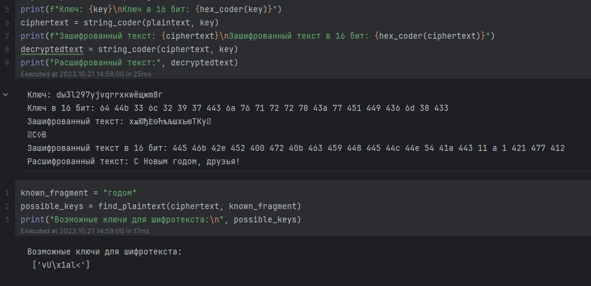

---
## Front matter
title: "Лабораторная работа №7. Элементы криптографии. Однократное гаммирование"
subtitle: "Дисциплина: Информационная безопасность"
author: "Манаева Варвара Евгеньевна"

## Generic otions
lang: ru-RU
toc-title: "Содержание"

## Bibliography
bibliography: bib/cite.bib
csl: pandoc/csl/gost-r-7-0-5-2008-numeric.csl

## Pdf output format
toc: true # Table of contents
toc-depth: 2
lof: true # List of figures
lot: true # List of tables
fontsize: 12pt
linestretch: 1.5
papersize: a4
documentclass: scrreprt
## I18n polyglossia
polyglossia-lang:
  name: russian
  options:
	- spelling=modern
	- babelshorthands=true
polyglossia-otherlangs:
  name: english
## I18n babel
babel-lang: russian
babel-otherlangs: english
## Fonts
mainfont: PT Serif
romanfont: PT Serif
sansfont: PT Sans
monofont: PT Mono
mainfontoptions: Ligatures=TeX
romanfontoptions: Ligatures=TeX
sansfontoptions: Ligatures=TeX,Scale=MatchLowercase
monofontoptions: Scale=MatchLowercase,Scale=0.9
## Biblatex
biblatex: true
biblio-style: "gost-numeric"
biblatexoptions:
  - parentracker=true
  - backend=biber
  - hyperref=auto
  - language=auto
  - autolang=other*
  - citestyle=gost-numeric
## Pandoc-crossref LaTeX customization
figureTitle: "Рис."
tableTitle: "Таблица"
listingTitle: "Листинг"
lofTitle: "Список иллюстраций"
lotTitle: "Список таблиц"
lolTitle: "Листинги"
## Misc options
indent: true
header-includes:
  - \usepackage{indentfirst}
  - \usepackage{float} # keep figures where there are in the text
  - \floatplacement{figure}{H} # keep figures where there are in the text
---

# Техническое оснащение:

- Персональный компьютер с операционной системой Windows 10;
- Планшет для записи видеосопровождения и голосовых комментариев;
- Microsoft Teams, использующийся для записи скринкаста лабораторной работы;
- Приложение Pycharm для редактирования файлов формата *md*;
- *pandoc* для конвертации файлов отчётов и презентаций.

# Цели и задачи работы
## Цель

Изучение механизма шифрования гаммирование как простейшего варианта системы шифрования с закрытым ключом.

## Задачи [@lab:7]

Нужно подобрать ключ, чтобы получить сообщение «С Новым Годом, друзья!». Требуется разработать приложение, позволяющее шифровать и дешифровать данные в режиме однократного гаммирования. Приложение должно:

1. Определить вид шифротекста при известном ключе и известном открытом тексте.
2. Определить ключ, с помощью которого шифротекст может быть преобразован в некоторый фрагмент текста, представляющий собой один из возможных вариантов прочтения открытого текста.

# Теоретическое введение

Принцип, легший в основу гаммирования, предложил Vernam, Gilbert S. в 1926 в своей первой официальной публикации «Cipher Printing 
Telegraph Systems For Secret Wire and Radio Telegraphic Communications» попавшую в выпуск газеты  "Journal of the IEEE 55" 
под номером 109-115. В последствии называемая "схема однократного использования" или более популярное "Шифр Вернама".

Гаммирование представляет собой наложение (снятие) на открытые (зашифрованные) данные последовательности элементов других 
данных, полученной с помощью некоторого криптографического алгоритма, для получения зашифрованных (открытых) данных. Иными 
словами, наложение гаммы — это сложение её элементов с элементами открытого (закрытого) текста по некоторому фиксированному 
модулю, значение которого представляет собой известную часть алгоритма шифрования.

К. Шеннон доказал абсолютную стойкость шифра в случае, когда однократно используемый ключ, длиной, равной длине исходного 
сообщения, является фрагментом истинно случайной двоичной последовательности с равномерным законом распределения. Криптоалгоритм 
не даёт никакой информации об открытом тексте: при известном зашифрованном сообщении C все различные ключевые последовательности K 
возможны и равновероятны, а значит, возможны и любые сообщения P.

Необходимые и достаточные условия абсолютной стойкости шифра:

– полная случайность ключа;
– равенство длин ключа и открытого текста;
– однократное использование ключа.

Рассмотрим пример.

Ключ Центра:

05 0C 17 7F 0E 4E 37 D2 94 10 09 2E 22 57 FF C8 0B B2 70 54

Сообщение Центра:

Штирлиц – Вы Герой!!  (D8 F2 E8 F0 EB E8 F6 20 2D 20 C2 FB 20 C3 E5 F0 EE E9 21 21)

Зашифрованный текст, находящийся у Мюллера:

DD FE FF 8F E5 A6 C1 F2 B9 30 CB D5 02 94 1A 38 E5 5B 51 75

Дешифровальщики попробовали ключ:

05 0C 17 7F 0E 4E 37 D2 94 10 09 2E 22 55 F4 D3 07 BB BC 54

и получили текст:

Штирлиц - Вы Болван! (D8 F2 E8 F0 EB E8 F6 20 2D 20 C2 FB 20 C1 EE EB E2 E0 ED 21)


# Выполнение лабораторной работы

1. Код и результат его выполнения (@fig:001)

```
import random
import string


def key_create(s, alf):
    k = ''.join(random.choice(alf) for i in range(s))
    return k


def hex_coder(cod):
    return ' '.join(hex(ord(i))[2:] for i in cod)

def string_coder(text, k, i_num):
    if i_num == 1:
        return ''.join(chr(ord(c) ^ ord(k)) for c, k in zip(text, k))
    else:
        return [''.join(chr(ord(c) ^ ord(k)) for c, k in zip(t, k)) for t in text]


def find_key(cypher, texts, s):
    possible_keys = []
    for f in range(len(texts)):
        for i in range(len(cypher[f]) - s + 1):
            key = [chr(ord(c) ^ ord(k)) for c, k in zip(cypher[f][i:i + s], texts[f])]
            intact_plaintext = string_coder(cypher[f], key, 1)
            if texts[f] in intact_plaintext:
                possible_keys.append(''.join(key))
    return possible_keys
    
plaintext = "С Новым годом, друзья!"
size = len(plaintext)
leng = russian_present(plaintext)
key = key_create(size, leng)
print(f"Ключ: {key}\nКлюч в 16 бит: {hex_coder(key)}")
ciphertext = string_coder(plaintext, key)
print(f"Зашифрованный текст: {ciphertext}\nЗашифрованный текст в 16 бит: {hex_coder(ciphertext)}")
decryptedtext = string_coder(ciphertext, key)
print("Расшифрованный текст:", decryptedtext)

known_fragment = "годом"
possible_keys = find_plaintext(ciphertext, known_fragment)
print("Возможные ключи для шифротекста:\n", possible_keys)
```

{#fig:001 width=80% height=80%}

# Контрольные вопросы

1. Поясните смысл однократного гаммирования.

Ответ: это шифрование симметричным методом, сущность которого заключается в «наложении» последовательности, сформированной
из случайных чисел, на открытый текст. Прощё говоря это шифрование, где количество символов совпадает в ключе и тексте совпадает
и без ключа нельзя одназначно декодировать текст обратно.

2. Перечислите недостатки однократного гаммирования.

Ответ: Необходимо передавать ключ вместе со словом, так как его невозможно создать заранее, а также сложность обмена ключами в большой
системе и вероятность его повреждение что сразу сделает дешифровку невозможной.

3. Перечислите преимущества однократного гаммирования.

Ответ: Простой и одинаковый процесс кодирования и декодирования, единый ключ для шифровки и дешифровки, скорость обработки и передачи так как требуется лишь текст и его ключ.

4. Почему длина открытого текста должна совпадать с длиной ключа?

Ответ: Так как при кодировании элемент ключа закрепляется за соответствующим элементом сообщения из-за чего и возможна однозначно декодировать сообщение.

5. Какая операция используется в режиме однократного гаммирования, назовите её особенности?

Ответ: Фактически ответ содержится в одном из названий этого принципа "Шифр XOR", тоесть в его основе находится строгая дизъюнкция которая и принимает в себя случайный ключ и текст и обратно "отзеркаливает" если вернуть зашифрованный текст вместе с ключём.

6. Как по открытому тексту и ключу получить шифротекст?

Ответ: Для получения шифротекста применяем операцию исключающего ИЛИ (XOR) между каждым символом открытого текста и соответствующим символом ключа. Процесс можно построить следующим образом: открытый текст и ключ в виде последовательности байтов или символов;  поэлементно выполняем операцию XOR с открытого текста и ключа; резуьтат этой операции и будет шифротекст.

7. Как по открытому тексту и шифротексту получить ключ?

Ответ: Сооответсвенно анологичная процедура из 6 пункта, так как процесс кодирование и декадирование одинаковы.

8. В чем заключаются необходимые и достаточные условия абсолютной стойкости шифра?

Ответ: Необходимыми и достаточными условиями абсолютной стойкости шифра являются полная случайность ключа, равенство длин ключа и открытого текста, однократное использование ключа.

Абсолютная стойкость рассмотренной схемы требует слишком высокой цены, она чрезвычайно дорога и непрактична. Основной ее недостаток — равенство объема ключевой информации и суммарного объема передаваемых сообщений.


# Выводы по проделанной работе

## Вывод

В результате выполнения работы были освоены на практике применение режима однократного гаммирования.

Были записаны скринкасты выполнения и защиты лабораторной работы.

Ссылки на скринкасты:

- [Выполнение, Youtube](https://youtu.be/c1HbX1IepSk)
- [Выполнение, Rutube](https://rutube.ru/video/6d78740f3517115fd495573f13569189/)
- [Защита презентации, Youtube](https://youtu.be/myeKXY_bepg)
- [Защита презентации, Rutube](https://rutube.ru/video/82417159592098e8a3ac2b142f7d7edd/)

# Список литературы

