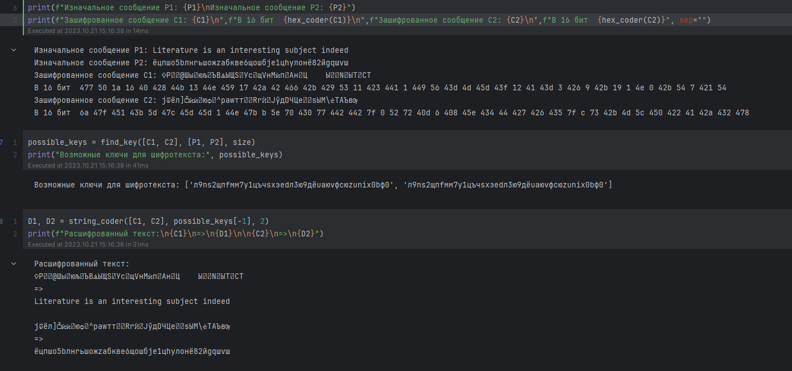

---
## Front matter
title: "Лабораторная работа №1"
subtitle: "Дисциплина: Информационная безопасность"
author: "Манаева Варвара Евгеньевна"

## Generic otions
lang: ru-RU
toc-title: "Содержание"

## Bibliography
bibliography: bib/cite.bib
csl: pandoc/csl/gost-r-7-0-5-2008-numeric.csl

## Pdf output format
toc: true # Table of contents
toc-depth: 2
lof: true # List of figures
lot: true # List of tables
fontsize: 12pt
linestretch: 1.5
papersize: a4
documentclass: scrreprt
## I18n polyglossia
polyglossia-lang:
  name: russian
  options:
	- spelling=modern
	- babelshorthands=true
polyglossia-otherlangs:
  name: english
## I18n babel
babel-lang: russian
babel-otherlangs: english
## Fonts
mainfont: PT Serif
romanfont: PT Serif
sansfont: PT Sans
monofont: PT Mono
mainfontoptions: Ligatures=TeX
romanfontoptions: Ligatures=TeX
sansfontoptions: Ligatures=TeX,Scale=MatchLowercase
monofontoptions: Scale=MatchLowercase,Scale=0.9
## Biblatex
biblatex: true
biblio-style: "gost-numeric"
biblatexoptions:
  - parentracker=true
  - backend=biber
  - hyperref=auto
  - language=auto
  - autolang=other*
  - citestyle=gost-numeric
## Pandoc-crossref LaTeX customization
figureTitle: "Рис."
tableTitle: "Таблица"
listingTitle: "Листинг"
lofTitle: "Список иллюстраций"
lotTitle: "Список таблиц"
lolTitle: "Листинги"
## Misc options
indent: true
header-includes:
  - \usepackage{indentfirst}
  - \usepackage{float} # keep figures where there are in the text
  - \floatplacement{figure}{H} # keep figures where there are in the text
---

# Техническое оснащение:

- Персональный компьютер с операционной системой Windows 10;
- Планшет для записи видеосопровождения и голосовых комментариев;
- Microsoft Teams, использующийся для записи скринкаста лабораторной работы;
- Приложение Pycharm для редактирования файлов формата *md*;
- *pandoc* для конвертации файлов отчётов и презентаций.

# Цели и задачи работы
## Цель


## Задачи


# Теоретическое введение


# Выполнение лабораторной работы

1. (@fig:001)

```

```

{#fig:001 width=80%}

2. (@fig:002)

```

```

{#fig:002 width=80%}

3. (@fig:003)

```

```

{#fig:003 width=80%}

4. (@fig:004)

```

```

{#fig:004 width=80%}

5. (@fig:005)

```

```

{#fig:005 width=80%}

6. (@fig:006)

```

```

{#fig:006 width=80%}

7. (@fig:007)

```

```

{#fig:007 width=80%}

8. (@fig:008)

```

```

{#fig:008 width=80%}

9. (@fig:009)

```

```

{#fig:009 width=80%}

10. (@fig:0010)

```

```

{#fig:0010 width=80%}

11. (@fig:0011)

```

```

{#fig:0011 width=80%}

12. (@fig:0012)

```

```

{#fig:0012 width=80%}

13. (@fig:0013)

```

```

{#fig:0013 width=80%}

14. (@fig:0014)

```

```

{#fig:0014 width=80%}

15. (@fig:0015)

```

```

{#fig:0015 width=80%}

16. (@fig:0016)

```

```

{#fig:0016 width=80%}

17. (@fig:0017)

```

```

{#fig:0017 width=80%}

18. (@fig:0018)

```

```

{#fig:0018 width=80%}

19. (@fig:0019)

```

```

{#fig:0019 width=80%}

20. (@fig:0020)

```

```

{#fig:0020 width=80%}

21. (@fig:0021)

```

```

{#fig:0021 width=80%}

22. (@fig:0022)

```

```

{#fig:0022 width=80%}

23. (@fig:0023)

```

```

{#fig:0023 width=80%}

## Домашнее задание


# Контрольные вопросы


: Описание некоторых каталогов файловой системы GNU Linux {#tbl:std-dir}

| Имя каталога | Описание каталога                                                                                                          |
|--------------|----------------------------------------------------------------------------------------------------------------------------|
| `/`          | Корневая директория, содержащая всю файловую                                                                               |

Более подробно об Unix см. в [@gnu-doc:bash;@newham:2005:bash;@zarrelli:2017:bash;@robbins:2013:bash;@tannenbaum:arch-pc:ru;@tannenbaum:modern-os:ru].

# Выводы по проделанной работе

## Вывод

В результате выполнения работы мы ознакомились с основными этапами установки виртуальных машин и их настроек, 
а также создали виртуальную среду для выполнения последующих лабораторных работ.

Были записаны скринкасты выполнения и защиты лабораторной работы.

Ссылки на скринкасты:

- [Выполнение, Youtube](https://youtu.be/p9smbkIezso)
- [Выполнение, Rutube](https://rutube.ru/video/1fdf6ef5d16783dda142099576af7bdc/)
- [Защита презентации, Youtube](https://youtu.be/CXELivKCEdQ)
- [Защита презентации, Rutube](https://rutube.ru/video/2ade4abf5bf61bcbefb9a8f3b2384f5a/)

# Список литературы{.unnumbered}

::: {#refs}
:::
